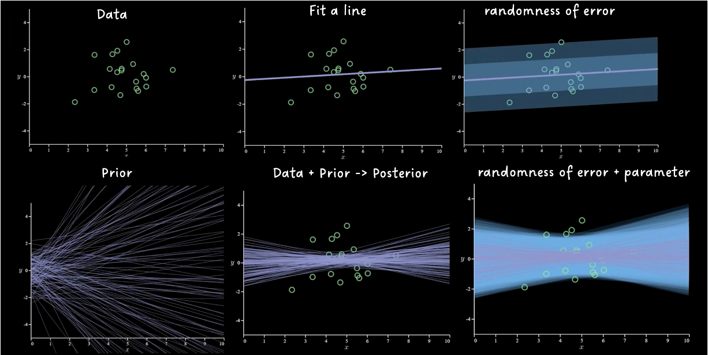
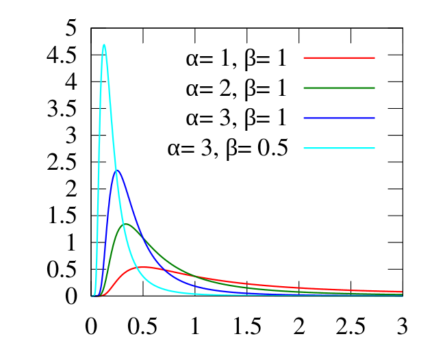
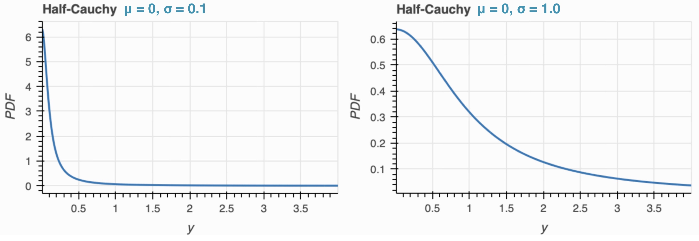

```{r setup, include=FALSE}
knitr::opts_chunk$set(echo = TRUE,
                      warning=FALSE,
                      message=FALSE)
```

## Topics 

- Get a brief introduction to Bayesian statistics and understand how it differs from the frequentists' point of view. 
- Understand how to select prior for parameters, evaluate model, and compare different model in a Bayesian framework.
- Understand how to create a Bayesian simple linear regression model with the `brms` package using different priors. 
- Understand how to create a Bayesian multivariate linear regression model with the `brms` package using different priors.

## Installations and Data

This tutorial will make use of the following R libraries.

```{r load-libraries, warning=FALSE, message=FALSE}
library(brms)
library(tidyverse)
library(bayesplot)
library(rstanarm)
library(broom)
library(ggplot2)
library(patchwork)
library(pander)
library(latex2exp)
```

This tutorial will be using the ``nhanes`` dataset where the variables are described in the file `nhanes-codebook.txt`. This data can be loaded with the `load` function, specifying the rda data file. 

```{r load-data}
load(file = 'nhanes1518.rda')
```

## Introduction to Bayesian Statistics

### Beliefs and Priors

There are two schools of thought in the world of statistics: frequentist, which we have been working with up to this point, and Bayesian. In the frequentist school, probability is defined as a frequency. For example, if we roll a fair six-sided die, the probability we will roll a 1 is $P(Y = 1) = \frac{1}{6}$. The conclusions we make in frequentist statistics are based on likelihood; we retrieve data and then make an inference based on the data.

In the Bayesian school, probability is defined as a belief. For example, a Bayesian statement could be "I believe the probability that it rains tomorrow is 30%." Different people obviously have different beliefs, so another statistician stating "I believe the probability that it rains tomorrow is 40%" could be just as valid. Like frequentist statistics, our conclusions rely on likelihood. However, unlike frequentist statistics, our conclusions combine the likelihood with another factor: our prior knowledge. When we collect data, we then combine our prior knowledge and our likelihood to *update* our prior knowledge. For simplicity, we can simply refer to our prior knowledge that we wish to update as the **prior**. After we see our data,  we combine our likelihood with our prior to create the **posterior**.

It is important to understand that different statisticians can have different priors for the same data. For example, a statistician who lives in the desert may believe that the probability that it rains tomorrow is 5%. However, if they move to the rainforest, their belief on future rain chances will change dramatically. This example analogizes how we combine our prior knowledge (living in the desert leads to a low chance for rain) with our data (the amount of rain after we move to the rainforest) to obtain our posterior (living in the rainforest leads to a high chance for rain). 

A statistician can also have no prior knowledge. Suppose, unrealistically, that a statistician has no idea how likely it is to rain on any given day. When that statistician is asked for the probability that it will rain tomorrow, they have no beliefs to go off of. This statistician can then use an **uninformative prior**, or one that tells us little about the situation at hand, to describe rain chances. A common example of an uninformative prior is a $Uniform(0, 1)$ distribution, which would mean the probability that it rains tomorrow has an equal chance of being any value from 0 to 1.

But how exactly do we get from the prior and the likelihood to the posterior?

### Bayes' Rule

The fundamental concept of Bayesian statistics is the fittingly-named **Bayes' rule**. Given a **likelihood function** $p(y | \theta)$ and a prior $p(\theta)$, the posterior $p(\theta | y)$ stated by Bayes' rule is $p(\theta | y) = \frac{p(y | \theta)p(\theta)}{p(y)}$.  $p(y)$ is the **marginal likelihood**, which we can get by integrating out the $\theta$ from the likelihood function:

$$
p(y) = \int p(y|\theta)p(\theta)d\theta
$$

For example, we can use the Bayes' rule with our `nhanes` dataset to estimate the mean weight (`BMXWT`) of the population. We may assume that the weights in our data are independent and identically distributed from a Normal distribution $y_i | \mu\sim N(\mu, \sigma^2)$. We also may have some prior knowledge of the mean weight $\mu$; let's say our belief is that $\mu$ also follows a normal distribution, $\mu ~ \sim N(\mu_0, \sigma_0^2)$. By plugging in our likelihood function $p(y|\mu)$ and our prior $p(\mu)$ and doing some algebra and calculus, we would obtain a posterior $p(\mu|y)$:

$$
\mu | y \sim N\left(\frac{\sigma_0^2}{\frac{\sigma^2}{n}+\sigma_0^2} \space \bar{y} \space + \frac{\sigma^2}{\frac{\sigma^2}{n}+\sigma_0^2} \space \mu_0 \space, \space \left(\frac{1}{\sigma_0^2} \space + \space \frac{n}{\sigma^2}\right)^{-1}\right)
$$

We can see that the posterior mean (the first parameter of the normal distribution above) is a weighted sum of the prior mean $\mu_0$ and the sample mean $\bar{y}$. This helps illustrate how the Bayes' rule combines the information from our data and from our prior in order to form the posterior. 

This is a rather simple example, since the function for $p(y)$ ends up being a closed-form expression and we are working with common distributions. Particularly, this example makes use of a **conjugate prior**: this occurs when the prior and posterior all follow the same probability distribution. In this case, the prior and likelihood both came from a Normal distribution, and the posterior also ended up being normally distributed. Statisticians often prefer using conjugate priors as it makes computation much simpler. However, conjugate priors may not be available or well-suited for every scenario. Under other priors, we may not be able to obtain a closed-form expression for $p(y)$. In these situations where performing calculations proves to be extremely complex, we will not be able to apply the Bayes' rule in order to retrieve the posterior. We would then have to use other sampling schemes--for example, **Markov chain Monte Carlo**, which will be touched on later--in order to obtain the samples that follow the posterior distribution. 

### Posteriors & Inference

We have now discussed both the prior and the posterior, which correspond to the probability distributions of parameter $\theta$ before and after we obtain the data respectively. In Bayesian statistics, $\theta$ is a **random variable** or a quantity that can take on different values based on different outcomes of an experiment. Hence, $\theta$ comes from a probability distribution. This is a key distinction from frequentist statistics, where $\theta$ is a fixed value.

The different perspectives that frequentist and Bayesian statisticians have for what $\theta$ is correspond to different methods for inference. For example, frequentists may obtain the maximum likelihood estimator for $\theta$ and construct the confidence interval around this estimate. A limitation of this approach is that the probability is defined for the procedure of constructing the confidence interval, but it is not defined for a specific fixed sample. Thus, when interpreting a 95% confidence interval for example, we cannot say "there is a 95% chance that the confidence interval includes the true population parameter." Instead, we say that if we drew many samples from the population and created a 95% confidence interval for each sample, the true population parameter will be found in 95% of the intervals.

In Bayesian statistics, we obtain the posterior probability distribution of $\theta$ by applying Bayes’ rule to update our prior belief. We use the posterior distribution to make inference. For example, Bayesian statisticians usually use the mean of the posterior probability distribution as a point estimator. Then, they use quantiles of the posterior distribution to construct a **credible interval**, the Bayesian answer to a confidence interval. These have simpler interpretations.

To illustrate credible intervals, let's assume that the posterior distribution of $\theta$ is a $Uniform(0, 1)$ distribution. This means $\theta$ has an equal chance of being any value between 0 and 1. A 95% credible interval is between any lower bound $L$ and any upper bound $U$ such that the posterior probability of $L < p < U = 0.95$. We use the quantiles of our posterior distribution for $\theta$ to obtain $L$ and $U$. In the case of a 95% interval, these are the 0.025 and 0.975 quantiles (the middle 95% of the data). For a $Uniform(0, 1)$ distribution, this means $L = 0.025$ and $U = 0.975$. We can then say: "There is a 95% probability that the true population parameter lies between 0.025 and 0.975, given the evidence provided by the observed data."

## Bayesian Simple Linear Regression

### Notation, Parameters, and Assumptions

In statistics, we use **linear regression** to model the relationship between a **response variable** and one or more **explanatory variables**. Linear regression is done differently in frequentist statistics and Bayesian statistics.

In **simple linear regression**, we have one explanatory variable. Simple linear regression takes the form $y = \beta_0 +\beta_1 x +\epsilon$, where $y$ is the response variable, $x$ is the explanatory variable, $\beta_1$ is the true slope of the relationship between $x$ and $y$, $\beta_0$ is the true intercept of the relationship between $x$ and $y$, and $\epsilon$ is the random error term.

```{r image1, echo=FALSE}

```

In frequentists' statistics, linear regression uses point estimates for parameters $\beta_0$ and $\beta_1$ in order to help predict the value of the response variable based on the explanatory variable. The formula for **Bayesian regression** may appear to be the same, but now, our parameters are drawn from probability distributions. A vague prior suggests we have little prior knowledge on coefficients. As a result, the regression lines will spread out the space. In contrast, if we have strong prior on parameters, the line will be concentrated on a smaller space. Here we observe from the visualization, the prior is quite vague, after we see the data and update our prior, we will begin to update the prior with the data to obtain posterior which is more concentrated within a small range. 

The assumptions for Bayesian linear regression are the same for the frequentist method, being as follows:

  - **linearity**: The relationship between the response and explanatory variables is linear.
  - **independence**: The observations are independent of each other, meaning that the results for one observation are not influenced by the results of any other observation.
  - **homoscedasticity**: The variance of the errors is constant for all values of the explanatory variables.
  - **normality**: The errors are normally distributed.


It is important that these assumptions are not violated to preserve the validity of the regression model. Later, we will learn how to verify that our model fits these assumptions.

### Motivation

As discussed earlier, we perform simple linear regression when we want to explore the relationship between one explanatory variable and one response variable. For example, we might want to better understand the relationship between body mass index and age for a variety of reasons--perhaps we want to know if different age groups are more prone to obesity. We can help answer this question with a simple linear regression model using the `nhanes` dataset. 

For this linear model, we want to predict body mass index based on age; therefore, we will use `BMXBMI` as our response variable and `AGE_C` as our explanatory variable. We will limit our analysis to adults. We center the age at 18 years to facilitate the interpretation of intercept as the mean BMI value for 18 year olds.

```{r filter-to-adults}
nhanes1518 <- nhanes1518 %>% 
  filter(RIDAGEYR >= 18) %>%
  mutate(AGE_C = RIDAGEYR - 18)

```

### Model

We will use the `brms` library to fit our Bayesian model. An important part of creating a Bayesian regression model is establishing our priors for the parameters. Based on our prior knowledge of the data, there is a variety of priors we can set (and thus a variety of models we can create). Later, we will discuss strategies for selecting model priors. For now, we will assume that we have no prior knowledge of the dataset, using a noninformative prior. Notice the default prior in `brms` is heavy-tail t-distribution with a degree of freedom df = 3, mean and sd adjusted based on data. From the plot below, you can observe t-distribution has heavier tail compared to a normal distribution. As a result, a t-distribution prior is less sensitive to extreme values and thus the resulting model is more robust.

```{r t-vs-n, echo=FALSE}

# Define a sequence of values for x-axis
x <- seq(-5, 5, length.out = 1000)

# Calculate PDF values for t-distribution and normal distribution
df <- 3 # degrees of freedom for t-distribution
t_density <- dt(x, df)
normal_density <- dnorm(x)

# Create a data frame for ggplot
df_density <- data.frame(x = rep(x, 2),
                         density = c(t_density, normal_density),
                         distribution = rep(c("t-distribution", "Normal"), each = length(x)))

# Plot the densities
ggplot(df_density, aes(x = x, y = density, color = distribution, linetype = distribution)) +
  geom_line() +
  scale_color_manual(values = c("blue", "red")) +
  scale_linetype_manual(values = c("solid", "dashed")) +
  labs(title = "PDF of t-distribution with df = 3 compared with Normal distribution",
       x = "x", y = "Density") +
  theme_minimal()

```


We can use the `brm` function to specify our model. The `formula` argument of this function follows the format `y ~ x`, with `y` being the response variable and `x` being the explanatory variable. We will save our model in a variable named `model1`. Since Bayesian model fitting relies on random sampling, we specified the seed here to make sure it is reproducible. Here we just picked the seed at convenience. Please refer to this [R-blog](https://www.r-bloggers.com/2019/03/how-to-select-a-seed-for-simulation-or-randomization/) for picking a more scientific random seed.

```{r noninformative, echo = T, results = 'hide', warning = F, message = F}
model1 <- brm(formula = BMXBMI ~ AGE_C, 
             data    = nhanes1518,
             seed    = 123)
```

### Interpretation

Once we have created our model, we will then interpret its results. Our model gives us posterior distributions for $\beta_{Intercept}$ and $\beta_{Age}$; we can plot these with the `mcmc_dens` function of the `bayesplot` package, specifying the distributions we want to plot with the `pars` argument.

```{r plot-model1, fig.asp = 0.618}
mcmc_dens(model1, pars = c("b_Intercept", "b_AGE_C"))
```

We can also use the `summary` function to view detailed statistics of full posteriors. We will set the `priors` argument to `TRUE` so that the summary includes the prior distributions we used for our model. Here the default priors for coefficients and variance of error term are set to be t-distributions by default.


```{r noninformative-summary}
summary(model1, priors = TRUE)
```

### Annotated ouput

#### Model

The first three lines specify the data model $y_i|\mu,\sigma \sim N(\beta_{int}+\beta_{age} age_i,\sigma^2)$. The following two lines specify the dataset and settings of MCMC. We ran four chains, each chains have 2000 iterations with the first 1000 as warmup (discarding in the final analysis). Notice here we set `iter = 2000` is only for illustration. In practice, we usually set iteration to be at least 10000 to ensure the convergence of MCMC.

#### Priors


Suggest the prior of intercept is t-distribution with mean 28.4, sd 6.4, and df 3. The prior of $\sigma$ is half t-distribution with mean 0, sd 6.4, and df 3. These are the default priors specified by `brms` package since we do not specify any prior in our code. The mean 28.4 and sd 6.4 are estimated from data. 

Notice the default prior for coefficients $\beta_{age}$ is flat prior, which is a constant on the real line. $p(\beta)\propto 1, \beta \in (-\infty,\infty)$. If you wish to obtain the full priors for all the parameters, use `get_prior(model1)`.

#### Population-Level Effects

This provides summary statistics of posterior distribution of $\beta_{int}$ and $\beta_{age}$. `Estimate` provides posterior mean, and `l-95\% CI`, `u-95\% CI` provide 0.025- and 0.975- quantiles. 

#### Family Specific Parameter

This provides summary statistics of posterior distribution of $\sigma$. Similarly `Estimate` provides posterior mean, and `l-95\% CI`, `u-95\% CI` provide 0.025- and 0.975- quantiles. 

### Interpretation

Similar to frequentists, we have point estimates for $\beta_{Intercept}$ and $\beta_{Age}$ that we are interested in. These are the means of the posterior distributions we plotted with the `mcmc_dens` function. The estimates can be found in the `Intercept` and `BMXBMI` rows of the `summary` output. These tell us that point estimate for the intercept is 28.98, and the point estimate for our slope is 0.02. With these statistics, let's now fill in our model:

$$\hat{BMI} = 28.98 + 0.02(Age)$$

We can interpret the estimate of the slope to mean that we expect those who are 1 year older to have BMI 0.02 kg/m^2 higher, on average. For a person at age 18, his/her BMI is expected to be 28.98.

### Inference

We are also interested in the `l-95% CI` and `u-95% CI` columns of the `summary` output. These estimates are obtained from the credible intervals of the posterior distributions we plotted with `mcmc_dens`. We can thus state that there is a 95% chance that the average BMI for an individual at age 18 lies between 28.28 and 29.04. We have high confidence in the result that BMI tends to be higher for those who are older . 

Now that we have a credible interval for our slope, we might want to conclude whether there is a statistically significant relationship between BMI and age. To do so, we can examine whether or not $\hat{\beta_{Age}}$ is statistically different from 0. Our **null hypothesis** in this case is that the slope is equal to 0, while our **alternative hypothesis** is that the slope is not equal to 0 (which implies a linear relationship between BMI and age). We can answer this question with our credible interval. Since the interval for `AGE_C` does not include 0, we can reject our null hypothesis and conclude that there is likely a linear relationship between age and body mass index (although it appears to be very small).

### Prediction

Suppose we want to guess an individual's BMI using our model. We can do this with a **prediction interval**; it differs from using normal confidence intervals as confidence intervals only express sampling uncertainty from our data. On the other hand, prediction intervals express sampling uncertainty from our data and from the single value with which we want to predict. As a result, prediction intervals are wider than confidence intervals.

We can use the `predict` function with our model to predict individual's BMIs given an age of 18, 30, and 60.

```{r predict}
set.seed(123)
predict(model1,
        newdata = data.frame(AGE_C = c(18, 30, 60)-18),
        interval = "prediction",
        level = 0.95) %>%
  knitr::kable(digits = 2)
```

Our prediction interval estimates that a 18-year-old individual likely has a BMI between 14.765 and 43.32. As we can see, the interval is extremely wide, limiting our ability to make meaningful conclusions. We will later see in section [Posterior Predictive Check] that a transformation might this situation.


## Bayesian Multivariate Linear Regression

### Motivation

Now that we've tackled simple linear regression, let's learn how to do **multivariate linear regression** the Bayesian way. We do multivariate regression when we want to know how one variable is impacted by multiple other variables. We can also use this method when we want to control for some variable. For example, in our `nhanes` dataset, we might want to know how factors like age, waist size, weight, and height impact BMI; we might also want to know how waist size, weight, and height impact BMI if we control for age. To help answer these questions, we can fit a model with `BMXBMI` as the response and `AGE_C`, `BMXWAIST` as the predictors.

### Model

Let's first visualize the distribution of all of our predictor variables in the dataset. Notice the age is top-coded, which means age above 80 (62 after centering at 18) years are censored. 

```{r predictor-dists, fig.height = 3}
p1 <- ggplot(nhanes1518, aes(x = AGE_C)) + 
  geom_histogram(color = "black", fill = "red") +
  labs(title = 'Distribution of Age in Dataset')

p2 <- ggplot(nhanes1518, aes(x = BMXWAIST)) + 
  geom_histogram(color = "black", fill = "blue") +
  labs(title = 'Distribution of Waist Size in Dataset')


p1 + p2 + 
  plot_layout(ncol = 2)
```

As we can see from the x-axis labels, our predictors are not measured in the same way; age is in years, waist is in centimeters. This leads to these predictors having different ranges and, therefore, different variances. If we used this data as is, we would have to specify different variances for the prior distributions of each predictor. For simplicity purposes, we can use the `scale` function in R to normalize our data so that each predictor has a mean of 0 and a standard deviation of 1. This will allow us to specify the same prior for each of our predictor variables. Note that, in this example, scaling our data is for convenience; in real-world scenarios, this may not be the best approach. It's important to mention that scaling isn't required when utilizing the default prior in the package. The package automatically adjusts the prior according to the data.

```{r scale-data}
nhanes1518['AGE_C_sc'] <- scale(nhanes1518$AGE_C)
nhanes1518['BMXWAIST_sc'] <- scale(nhanes1518$BMXWAIST)
```

Again, we will begin by assuming we have no prior knowledge of the data and use the default the prior in `brms`. We will again use the `brm` function to create our model. The format for the `formula` argument here is `y ~ x1 + x2 + .. + xn`, where each $x_i$ is an explanatory variable.

```{r multi-model1, echo = T, results = 'hide', warning = F, message = F}
multi_model1 <- brm(formula = BMXBMI ~ AGE_C_sc + BMXWAIST_sc, 
             data    = nhanes1518,
             seed    = 123)
```

### Interpretation

We can once again interpret our model's results with the `summary` function.

```{r multimodel1-summary}
summary(multi_model1, priors = TRUE)
```

With these statistics, we can now fill in our model:

$$\hat{BMI} = 29.41 -1.12Age\_sc + 6.67Waist\_sc$$

We can interpret the estimate of the slope of age to mean that for every one standard deviation increase in scaled age, we expect BMI to decrease by 1.12 on average, **holding all other factors constant**. Since we scaled our data, we also have a meaningful interpretation for our intercept: we expect a person with the average age, waist size to have a BMI of 29.41.

### Inference

We can again look at the `l-95% CI` and `u-95% CI` columns to obtain 95% credible intervals for our intercept and estimates. Since all of the intervals do not include 0, we can reject our null hypothesis for all variables and conclude that, holding all other factors constant, there is likely a linear relationship between age and BMI, and waist size and BMI.

## Prior Selection

### Introduction

So far in this tutorial, we have used the default priors for our linear regression models. However, one of the foundations of Bayesian statistics is setting an informative prior, or one that tells us something about the data.

Prior selection is especially important when we do not have a lot of data. In these cases, since there is not much data to go off of, much of our inference comes from the prior. This means it is vital that we select a fitting distribution, or we risk an inaccurate posterior.

Different priors have different motivations and properties. Some scrupulous scientists want to be as objective as possible when choosing a prior, while others may aim to choose a prior that satisfies experts with different opinions. This section will discuss common priors used for coefficients ($\beta$) and variances ($\sigma^2$).

Since we have thousands of observations in our dataset, the different priors we may set would yield similar results. To better demonstrate how choosing different priors can impact our model, let's take a sample of our dataset of size `n = 30`. 

```{r sample-subset}
set.seed(456)
nhanes1518_sample <- sample_n(nhanes1518, 30)
```

Now, using our sampled data, let's see the results of a model using default priors.

```{r noninformative-subset, echo = T, results = 'hide', warning = F, message = F}
default_prior <- brm(formula = BMXBMI ~ AGE_C, 
             data    = nhanes1518_sample,
             seed    = 123)
```

```{r noninformative-subset-summary}
summary(default_prior, priors = TRUE)
```

We get the model $\hat{BMI} = 34.03 - 0.11(Age)$. 

We can use `prior_summary` to obtain the default prior. We can see the default prior for intercept and sigma (sd of error term) is t-distribution, and default prior for slope is a flat prior ($f(\beta) \propto 1, \beta \in (-\infty,\infty)$). We will compare this to models using specified priors.

```{r def_pri}
prior_summary(default_prior)
```


### Coefficient Priors: The Normal Distribution

A common prior for the coefficient (or $\beta$) in Bayesian inference deals with a **normal (Gaussian) distribution**. This is a **conjugate** prior, meaning that the posterior will also be a normal distribution, but with different parameters. This might be a good choice for our beta prior if we assume our data is normally distributed, meaning most values are situated in the middle, and there is a symmetrical decline in the frequency of values as we reach the ends.

We will use the same `BMXBMI ~ AGE_C` model we worked with in the single linear regression section. Let's assume the BMI values in our sample are normally distributed. We will choose a normal distribution with $\mu = 0$ and $\sigma = 0.3$ for $\beta_{Age}$. We can use the `prior` argument in the `brm` function to set our prior for $\beta$. In this argument, we set `class = "b"` and `coef = "AGE_C"` to signify that this is a prior on $\beta_{Age}$. Notice that the parametrization in the function takes the form "normal(mean,sd)".

```{r model2, echo = T, results = 'hide', warning = F, message = F}
model2 <- brm(formula = BMXBMI ~ AGE_C, 
             data    = nhanes1518_sample,
             prior   = c(set_prior("normal(0, 0.3)", class = "b", coef = "AGE_C")),
             seed    = 123)
```

Now, let's use the `mcmc_intervals` function of the `bayesplot` package to compare the values of $\beta_{Age}$ for each of our two models so far:

```{r model2-summ, fig.asp = 0.55}
(mcmc_intervals(
  default_prior,
  point_est = "mean",
  prob_outer = 0.95,
  pars = c("b_AGE_C")) +
   coord_cartesian(xlim = c(-0.35, 0.1)) +
   labs(title = "Default Prior (Flat Prior)") +
   theme_minimal()
 ) /
  (mcmc_intervals(
    model2,
    point_est = "mean",
    pars = c("b_AGE_C")) +
     coord_cartesian(xlim = c(-0.35, 0.1)) +
     labs(title = TeX("Normal(0, $0.3^2$) Coefficient Prior")) +
     theme_minimal()
   )
```

The thick line represents a 50% credible interval, while the thin line represents a 95% credible interval. As we can see, both models have similar point estimates for the mean of $\beta_{Age}$, but the intervals differ in length. Our $N(0, 0.3^2)$ model has a narrower interval, likely because we supplied a prior with a small variance. This signifies how different priors can yield different posteriors.

Let's run another model with a normally distributed $\beta$ prior, using the same mean but inputting a much larger variance.

```{r model3, echo = T, results = 'hide', warning = F, message = F}
model3 <- brm(formula = BMXBMI ~ AGE_C, 
             data    = nhanes1518_sample,
             prior   = c(set_prior("normal(0, 100)", class = "b", coef = "AGE_C")),
             seed    = 123)
```

```{r model3-summ, fig.asp = 0.3}
mcmc_intervals(
  model3,
  point_est = "mean",
  prob_outer = 0.95,
  pars = c("b_AGE_C")) +
   coord_cartesian(xlim = c(-0.35, 0.1)) +
   labs(title = TeX("Normal(0, $100^2$) Coefficient Prior")) +
   theme_minimal()
```

The results of this model more closely resemble our default model as compared to our model with the $N(0, 0.3^2)$ prior. This is because our extremely large variance means we are very unsure about the value of $\beta_{Age}$; thus, this prior is largely noninformative, similar to the default. 

Let's recap the models we've created so far with their results:

```{r model-recap1, echo = F, warning = F, message = F, fig.asp = 0.75}
(mcmc_intervals(
  default_prior,
  point_est = "mean",
  prob_outer = 0.95,
  pars = c("b_AGE_C")) +
   coord_cartesian(xlim = c(-0.35, 0.1)) +
   labs(title = "Default Prior (Flat Prior)") +
   theme_minimal()
 ) /
  (mcmc_intervals(
    model2,
    point_est = "mean",
    pars = c("b_AGE_C")) +
     coord_cartesian(xlim = c(-0.35, 0.1)) +
     labs(title = TeX("Normal(0, $0.3^2$) Coefficient Prior")) +
     theme_minimal()
   ) /
  (mcmc_intervals(
    model3,
    point_est = "mean",
    prob_outer = 0.95,
    pars = c("b_AGE_C")) +
      coord_cartesian(xlim = c(-0.35, 0.1)) +
      labs(title = TeX("Normal(0, $100^2$) Coefficient Prior")) +
      theme_minimal()
   )
```

### Coefficient Priors: The T-Distribution

Another common prior for the coefficient in Bayesian inference deals with the **student t-distribution**. This differs from the normal distribution in that the values are less clustered in the middle, giving it heavier tails on the ends. Using the t-distribution can offer more robust estimation; it is often used on smaller, approximately normal datasets (for example, when n < 30). For the purpose of this section, we will proceed using a t-distribution to estimate $\beta_{Age}$.

We can change the shape of our t-distribution by altering the **degrees of freedom**; the more degrees of freedom we have, the more we will resemble a normal distribution (so, the less heavy the tail ends will be). Let's fit a model with a beta prior distributed as a unit t-distribution with 3 degrees of freedom:

```{r model4, echo = T, results = 'hide', warning = F, message = F}
model4 <- brm(formula = BMXBMI ~ AGE_C, 
             data    = nhanes1518_sample,
             prior   = c(set_prior("student_t(3, 0, 1)", class = "b", coef = "AGE_C")),
             seed    = 123)
```

```{r model4-summ, fig.asp = 0.3}
mcmc_intervals(
  model4,
  point_est = "mean",
  prob_outer = 0.95,
  pars = c("b_AGE_C")) +
   coord_cartesian(xlim = c(-0.35, 0.1)) +
   labs(title = TeX("Student_T(3, 0, 1) Coefficient Prior")) +
   theme_minimal()
```

Again, our model results resemble those we have previously calculated. For demonstrative purposes, let's also run a model with more degrees of freedom (a more Gaussian-like distribution).

```{r model5, echo = T, results = 'hide', warning = F, message = F}
model5 <- brm(formula = BMXBMI ~ AGE_C, 
             data    = nhanes1518_sample,
             prior   = c(set_prior("student_t(30, 0, 1)", class = "b", coef = "AGE_C")),
             seed    = 123)
```

```{r model5-summ, fig.asp = 0.3}
mcmc_intervals(
  model5,
  point_est = "mean",
  prob_outer = 0.95,
  pars = c("b_AGE_C")) +
   coord_cartesian(xlim = c(-0.35, 0.1)) +
   labs(title = TeX("Student_T(30, 0, 1) Coefficient Prior")) +
   theme_minimal()
```

And now let's once again recap our models:

```{r model-recap2, echo = F, warning = F, message = F, fig.asp = 1}
(mcmc_intervals(
  default_prior,
  point_est = "mean",
  prob_outer = 0.95,
  pars = c("b_AGE_C")) +
   coord_cartesian(xlim = c(-0.35, 0.1)) +
   labs(title = "Default Prior (Flat Prior)") +
   theme_minimal()
 ) /
  (mcmc_intervals(
    model2,
    point_est = "mean",
    pars = c("b_AGE_C")) +
     coord_cartesian(xlim = c(-0.35, 0.1)) +
     labs(title = TeX("Normal(0, $0.3^2$) Coefficient Prior")) +
     theme_minimal()
   ) /
  (mcmc_intervals(
    model3,
    point_est = "mean",
    prob_outer = 0.95,
    pars = c("b_AGE_C")) +
      coord_cartesian(xlim = c(-0.35, 0.1)) +
      labs(title = TeX("Normal(0, $100^2$) Coefficient Prior")) +
      theme_minimal()
   ) /
  (mcmc_intervals(
    model4,
    point_est = "mean",
    prob_outer = 0.95,
    pars = c("b_AGE_C")) +
      coord_cartesian(xlim = c(-0.35, 0.1)) +
      labs(title = TeX("Student_T(3, 0, 1) Coefficient Prior")) +
      theme_minimal()
   ) /
  (mcmc_intervals(
    model5,
    point_est = "mean",
    prob_outer = 0.95,
    pars = c("b_AGE_C")) +
      coord_cartesian(xlim = c(-0.35, 0.1)) +
      labs(title = TeX("Student_T(30, 0, 1) Coefficient Prior")) +
      theme_minimal()
  )
```

Upon selecting our priors and running our models, we can then use our posterior information to conduct further regression. Usually, regardless of the initial choice of prior, results will end up converging to the same posterior after many iterations. In this case, since our sample size is now very small (`n = 30`), it might be more sensible to start with a student-t distribution for our $\beta_{Age}$ parameter, since t-distribution has a heavier tail, is more robust.

### Variance Priors: The Inverse-Gamma

```{r image2, echo=FALSE,fig.cap="Inverse Gamma Distributions"}

```

Now let's move on to our variance (or $\sigma^2$) parameter. A common prior for the variance in Bayesian inference deals with the **inverse gamma distribution**. This particular distribution restricts the variance to only positive values (we cannot have a negative variance as it is the value of the standard deviation squared). The inverse gamma distribution takes two parameters, $\alpha$ and $\beta$, which impact the shape (different permutations of these parameters are pictured above). It is also a conjugate distribution, so our posterior will be an inverse gamma distribution.

Let's run two models with inverse-gamma variance priors, using the parameters of the light blue line and the red line in the visualization above. We will use our `nhanes1518_sample` dataset that we created in the previous section.

```{r model6, echo = T, results = 'hide', warning = F, message = F}
model6 <- brm(formula = BMXBMI ~ AGE_C, 
             data    = nhanes1518_sample,
             prior   = c(set_prior("inv_gamma(3, 0.5)", class = "sigma")),
             seed    = 123)
```

```{r model7, echo = T, results = 'hide', warning = F, message = F}
model7 <- brm(formula = BMXBMI ~ AGE_C, 
             data    = nhanes1518_sample,
             prior   = c(set_prior("inv_gamma(1, 1)", class = "sigma")),
             seed    = 123)
```

### Variance Priors: The Half-Cauchy Distribution

```{r image3, echo=FALSE}

```

Another common prior for the variance in Bayesian inference deals with the **Half-Cauchy distribution**. The Cauchy distribution is equivalent to a student t-distribution with 1 degree of freedom. We then restrict this to only contain positive values (as again, our variance cannot be negative) to get the Half-Cauchy distribution. The Half-Cauchy takes two parameters, $\mu$ and $\sigma$, which impact the shape (two permutations of these parameters are pictured above). Similar to the student-t distribution, the Half-Cauchy has a heavy tail and provides more robust estimation.

Let's run two models with Half-Cauchy variance priors, using the parameters of the two examples pictured above. We will continue to use our `nhanes1518_sample` dataset. If we specify our `sigma` prior to be a `cauchy`, the `brms` package will automatically restrict it to positive values, thus effectively making it a Half-Cauchy. 

```{r model8, echo = T, results = 'hide', warning = F, message = F}
model8 <- brm(formula = BMXBMI ~ AGE_C, 
             data    = nhanes1518_sample,
             prior   = c(set_prior("cauchy(0, 0.1)", class = "sigma")),
             seed    = 123)
```

```{r model9, echo = T, results = 'hide', warning = F, message = F}
model9 <- brm(formula = BMXBMI ~ AGE_C, 
             data    = nhanes1518_sample,
             prior   = c(set_prior("cauchy(0, 1)", class = "sigma")),
             seed    = 123)
```

Let's visualize the results from all of our variance models with the `mcmc_intervals` function

```{r model-recap3, echo = F, warning = F, message = F, fig.asp = 0.8}
(mcmc_intervals(
  default_prior,
  point_est = "mean",
  prob_outer = 0.95,
  pars = c("sigma")) +
   coord_cartesian(xlim = c(6.5, 13)) +
   labs(title = "Default Prior (Half-T(3,0,5.5))") +
   theme_minimal()
 ) /
(mcmc_intervals(
  model6,
  point_est = "mean",
  prob_outer = 0.95,
  pars = c("sigma")) +
   coord_cartesian(xlim = c(6.5, 13)) +
   labs(title = "InvGam(3, 0.5) Variance Prior") +
   theme_minimal()
 ) /
  (mcmc_intervals(
    model7,
    point_est = "mean",
    pars = c("sigma")) +
     coord_cartesian(xlim = c(6.5, 13)) +
     labs(title = "InvGam(1, 1) Variance Prior") +
     theme_minimal()
   ) /
  (mcmc_intervals(
    model8,
    point_est = "mean",
    prob_outer = 0.95,
    pars = c("sigma")) +
      coord_cartesian(xlim = c(6.5, 13)) +
      labs(title = "Half-Cauchy(0, 0.1) Variance Prior") +
      theme_minimal()
   ) /
  (mcmc_intervals(
    model9,
    point_est = "mean",
    prob_outer = 0.95,
    pars = c("sigma")) +
      coord_cartesian(xlim = c(6.5, 13)) +
      labs(title = "Half-Cauchy(0, 1) Variance Prior") +
      theme_minimal()
   )
```

Notice specifically how the model with the $InvGam(3, 0.5)$ prior for the variance sticks out from the rest in terms of posterior $\sigma$. This is likely because of the prior’s large $\alpha$ parameter, which forces the prior to very sharply fit the data. Meanwhile, the model with the $Half-Cauchy(0, 1)$ prior for the variance has the widest credible interval. This is likely because of the prior's large $\sigma$ parameter, which corresponds to the prior weakly fitting the data.

### Priors for Multivariate Regression

When we construct a multivariate regression model, we have more parameters for which we can set a prior. For this section, we will construct the same model as in the section on multivariate regression, with BMI as the response and age, waist size as the predictors. However, we will now use the `nhanes1518_sample` dataset. We first need to scale our variables.

```{r scale-data-priors}
nhanes1518_sample['AGE_C_sc'] <- scale(nhanes1518_sample$AGE_C)
nhanes1518_sample['BMXWAIST_sc'] <- scale(nhanes1518_sample$BMXWAIST)
```

Now, let's create a model with the default parameters, which we will compare to a model with specified priors. The default priors are: flat priors for coefficients, t(3, 27.3, 5.6) for intercept, and half-t(3, 0, 5.6) for sigma.


```{r default-priors-multi, echo = T, results = 'hide', warning = F, message = F}
default_multi <- brm(formula = BMXBMI ~ AGE_C_sc + BMXWAIST_sc , 
             data    = nhanes1518_sample,
             seed    = 123)
```

```{r default-priors-multi-pri}
get_prior(formula = BMXBMI ~ AGE_C_sc + BMXWAIST_sc , 
             data    = nhanes1518_sample,
             seed    = 123)
```


In `brms`, we can set the prior for each coefficient separately. For this model, we will use a normal distribution prior for each $\beta$ with a mean of 0. Since we don't know much about the data, we want our prior to be relatively flat; thus we will use a relatively large variance of 100. We will also use a simple $HalfCauchy(0, 1)$ prior for sigma, and a relative flat $N(0, 22)$ prior for the intercept.

After we create our model, we will compare the results of the two models with `mcmc_intervals`.

```{r multi-model2, echo = T, results = 'hide', warning = F, message = F}
priors2 <- c(set_prior("normal(0, 10)", class = "b", coef = 'AGE_C_sc'),
             set_prior("normal(0, 10)", class = "b", coef = 'BMXWAIST_sc'),
             set_prior("cauchy(1, 1)", class = "sigma"),
             set_prior("normal(0, 22)", class = "Intercept"))

multi_model2 <- brm(formula = BMXBMI ~ AGE_C_sc + BMXWAIST_sc , 
             data    = nhanes1518_sample,
             prior   = priors2,
             seed    = 123)
```

```{r model-recap4, echo = F, warning = F, message = F, fig.asp = 0.8}
(mcmc_intervals(
  default_multi,
  point_est = "mean",
  prob_outer = 0.95,
  pars = c("b_AGE_C_sc", "b_BMXWAIST_sc")) +
   labs(title = "Default Priors") +
   theme_minimal()
 ) /
  (mcmc_intervals(
    multi_model2,
    point_est = "mean",
    pars = c("b_AGE_C_sc", "b_BMXWAIST_sc")) +
     labs(title = "Specified Priors") +
     theme_minimal()
   )
```

As we can see, the results of both models are very similar. This makes sense, as all of our specified priors in the second model were very unspecific (due to large variances). If we fit sharper priors, we could expect to see a larger difference in the posterior from the default model.

### Conclusion

Prior selection is a pivotal step of the Bayesian process. An informative prior can help make up for a lack of available data, allowing us to still obtain a posterior from which we can make meaningful interpretations and inferences.

This section goes over two common priors for both $\beta$ and $\sigma^2$ values. Using a normal distribution for $\beta$ and an inverse-gamma distribution for $\sigma^2$ can be a good choice if we believe most of our data is not too far from the mean. However, Bayesian statisticians tend to use a t-distribution for $\beta$ and a Half-Cauchy distribution for $\sigma^2$ as these are insensitive to outliers. Regardless, there is no predefined "best answer" on what prior to use in any given situation; it depends on our knowledge of the information. 


## MCMC Diagnostics 

There also exists a special diagnostic for Bayesian models: MCMC diagnostics. Most of the time, we usually cannot determine the exact posterior distribution from our model, but we can use **MCMC sampling** to draw samples from the posterior distribution. Therefore, we need to check **MCMC diagnostics** to ensure that the MCMC samples we obtain can accurately represent the true posterior distribution. 

In order to see if our Bayesian analysis is working and performing well, we need to examine **Markov chain Monte Carlo (MCMC) diagnostics**. In statistics, the Monte Carlo method refers to when we generate a sample of independent draws from the probability distribution of a random variable $X$ in order to estimate a feature of that distribution. The Markov chain Monte Carlo method is similar, but in this case the items in the generated sample are serially correlated rather than independent.

### Trace Plots

During model evaluation, samples from our posterior distributions will be generated using the MCMC method; we then can use **trace plots** to check convergence of our samples. Trace plots are line charts showing time on the x-axis, and values from the sample draws on the y-axis. We can use the `plot()` function in the `brms` package to display trace plots.

Let's first examine a model that passes MCMC diagnostics. We will continue to use the `nhanes1518_sample` dataset, and we will focus on simple linear regression models.

```{r mcmc1, echo = T, results = 'hide', warning = F, message = F}
mcmc1 <- brm(formula = BMXBMI ~ AGE_C, 
             data    = nhanes1518_sample,
             seed    = 123)
```

```{r mcmc1-trace, message = F, warning = F}
plot(mcmc1)
```

The plots on the right side are the trace plots. We want to see something that represents a fuzzy caterpillar; this means that the generated draws have low serial correlation and that the sample space is well explored. All three of our trace plots for this model fit the criteria. We can also do `summary(mcmc1)` and look at the values in the `Rhat` column; a value of 1 means our Markov chains have converged sufficiently, which is what we are looking for.

Now, let's examine some models that fail MCMC diagnostics. Let's run the same model as the previous example, but set the `iter` parameter to equal 50 (`brms` defaults this parameter to 2000).

```{r mcmc2, echo = T, results = 'hide', warning = F, message = F}
mcmc2 <- brm(formula = BMXBMI ~ AGE_C, 
             data    = nhanes1518_sample,
             seed    = 123,
             iter    = 50)
```

```{r mcmc2-trace}
plot(mcmc2)
```

Here, we see our trace plots look vastly different than the ones in the `iter = 2000` example. With plots like this, we can infer that the generated draws have high serial correlations and that the chains have not yet converged around any value. This means that the effective size of our sample is too small; we can fix this issue by increasing the number of iterations (in this case, changing the `iter` parameter when fitting our model).

For this next model, we will use the same structure as the previous two models, except we will set the `iter` parameter to 400 and the `warmup` to 10 (the `warmup` parameter defaults to `iter/2`).

```{r mcmc3, echo = T, results = 'hide', warning = F, message = F}
mcmc3 <- brm(formula = BMXBMI ~ AGE_C, 
             data    = nhanes1518_sample,
             seed    = 123,
             iter    = 400,
             warmup  = 10)
```

```{r mcmc3-trace}
plot(mcmc3)
```

Here, we see that the first portions of the trace plots look very different than the rest; this means our chains are eventually converging to the target distribution (as we get to the 'fuzzy caterpillar' portion), but our initial distributions are largely different than the target. We can fix this by increasing the `warmup` parameter, which discards a number of the initial observations.

### Autocorrelation

Trace plots allow us to examine the extent to which serial correlation exists among the draws from our model. We can look at this serial correlation more specifically by plotting the **autocorrelation function (ACF)** of our model. 

Let's plot the autocorrelation for `mcmc1`, the model that we just showed passes MCMC diagnostics. We can use the `mcmc_acf` function of the `bayesplot` package to do so, using the `pars` argument to specify which ACFs we want to see. Recall that an assumption for Bayesian linear regression is the presence of no autocorrelation; thus, we want the ACFs to quickly approach zero. 

```{r autocorr-mcmc1}
mcmc_acf(mcmc1, pars = c("b_Intercept", "b_AGE_C", "sigma"))
```

The ACFs for this model all quickly approach zero, meaning this is a valid model in terms of the no autocorrelation assumption.

Let's compare these plots to those for the `mcmc3` model, which we just showed fails MCMC diagnostics.

```{r autocorr-mcmc3}
mcmc_acf(mcmc3, pars = c("b_Intercept", "b_AGE_C", "sigma"))
```

These plots take much longer to reach zero, indicating a high degree of serial correlation. We would likely want to refit this model.

### Effective Sample Size

Autocorrelation is closely related to another indicator used in model evaluation: the **effective sample size**. This metric, often notated as $n_{eff}$, estimates the total number of independent draws made from sampling the posterior distribution. Autocorrelation, of course, means that some sequential draws will not be independent. Thus, $n_{eff}$ is usually smaller than the overall sample size $N$. 

We can examine effective sample size using the `neff_ratio` and `mcmc_neff` functions from the `bayesplot` package. `neff_ratio` calculates the ratio $\frac{n_{eff}}{N}$ for each parameter specified in the `pars` argument. `mcmc_neff` then takes a vector of these ratios and plots them. Let's continue to use `mcmc1`, our diagnostic-passing model, and plot its effective sample sizes. We add `theme_minimal` to make the plot easier to read.

```{r neff-mcmc1}
neff_mcmc1 <- neff_ratio(mcmc1, pars = c("b_Intercept", "b_AGE_C", "sigma"))
mcmc_neff(neff_mcmc1) + theme_minimal()
```

This plot shows that the effective sample sizes for the parameters of this model are all close to the overall sample sizes. We want to see ratios closer to 1 (indicated by the lightest blue lines), as these indicate the lowest levels of autocorrelation.

Let's compare these results to those for `mcmc3`, one of our diagnostic-failing models. 

```{r neff-mcmc3}
neff_mcmc3 <- neff_ratio(mcmc3, pars = c("b_Intercept", "b_AGE_C", "sigma"))
mcmc_neff(neff_mcmc3) + theme_minimal()
```

As we can see, the effective sample size ratios are much lower for this model, as indicated by darker blue lines. This means there are very little amounts of independent draws from the posterior distributions, indicating high levels of autocorrelation. As concluded earlier, we would want to refit this model. 

## Model Evaluation

In the section on single linear regression, we mentioned a list of assumptions for Bayesian linear regression that help ensure the validity of our model. In frequentists' framework, we usually check the assumptions for a linear model using residual plots (Check [module on frequentist linear regression](https://chem-mix.netlify.app/slides/01-linear_regression#Model_Diagonostics_and_Evaluations) for more details). We can do the similar check in Bayesian statistics. 

In addition, Bayesian can construct posterior check, generating posterior samples and compare them with original data to evaluate the model performance. 


### Posterior Predictive Check

In Bayesian estimation, we can obtain posterior samples $\theta = (\theta^{(1)},\dots,\theta^{(N)})$. From which we can generate posterior predictions of response variables $Y^* = (Y^*{(1)},\dots,Y^*{(N)})$, to check whether they are close to the original data. In addition, we can construct any statistics based on $\theta$ or $Y^*$, and compare these posterior samples to the feature of original data. If the data-based statistics lie at the tail of distribution of the posterior samples, we may conclude the model does not fit the data well at least cannot capture the desired feature well.

The function `pp_check` can generate posterior samples $Y^*$ and plot it with the original data. We can observe the posterior samples deviates from original data, which does not seems a good fit. 

```{r ppcheck1}
pp_check(model1,nreps = 50)
```

We know the reason in previous tutorial [module on frequentist linear regression](https://chem-mix.netlify.app/slides/01-linear_regression#Linear_Regression) that BMI has long tail, and thus the error term does not follow normal distribution. Here we fit the regression model use log(BMI) and construct posterior predictive check. It shows the model fits the data well.

```{r model1log, echo = T, results = 'hide', warning = F, message = F}
model1log <- brm(formula = log(BMXBMI) ~ AGE_C, 
             data    = nhanes1518,
             seed    = 123)
```


```{r ppchecklog1, echo=FALSE}
pp_check(model1log,nreps = 50)
```

`pp_check` helps to compare the distribution of orginal data and posterior samples. Suppose we are interested in evaluating the performance of our model when predicting the BMI of age 18. We can generate responses given age equals to 18 and check how the true data locate in the posterior distribution. `posterior_predict` can help us generated multiple sets of posteriors samples given the new data. `ppc_intervals` can help us visualize the credible intervals and compare them with original data. 


To ease computation, we draw 1000 samples from the data to evaluate the performance. For each data point, we generate 4000 posterior samples for different ages. We can observe the posterior interval fail to capture a few data points. There are some other important factors need to be introduced to the model.

```{r}
set.seed(1)
nhanes1518_sample1000=na.omit(nhanes1518%>%select(BMXBMI,AGE_C))
nhanes1518_sample1000 <- sample_n(nhanes1518_sample1000, 1000)

set.seed(1)
predictions <- posterior_predict(model1, newdata = nhanes1518_sample1000)
dim(predictions)
ppc_intervals(nhanes1518_sample1000$BMXBMI,
              yrep = predictions, x = nhanes1518_sample1000$AGE_C, 
              prob = 0.5, prob_outer = 0.95)
```


## Model Comparison

Suppose we have multiple Bayesian linear regression models, and we desire to know which one is "better". To accomplish this, we can do **model comparison** to determine which of our models minimizes prediction error. 

One metric we can use to compare Bayesian models is the **Widely Applicable Information Criterion (WAIC)**, which is an extension of the AIC metric. This statistic is a measurement of prediction error, and therefore we want to choose the model with the smallest WAIC.

Let's compare the three models we just used to evaluate MCMC diagnostics. We can visualize their WAIC values, which are calculated using the `waic()` method in the `brms` package.

```{r waic-comparisons}
waic1 <- waic(mcmc1)$waic
waic2 <- waic(mcmc2)$waic
waic3 <- waic(mcmc3)$waic
wx <- c(waic1, waic2, waic3)
barplot(wx, ylab = "WAIC", names.arg=paste("mcmc", 1:3))
```

We see that the WAIC for mcmc1 is the lowest. This makes intuitive sense, as this was the model that passed MCMC diagnostics. If we were comparing these three models, we would proceed with `mcmc1`.

We can also use WAIC to determine what are the best priors to select for our data. Let's take a look at the first five models we fitted in this module, using the `nhanes1518_sample` dataset. Model 2 to 5 represent the model with prior $N(0.0.09)$, $N(0, 10000)$, $StudentT(3, 0, 1)$, $StudentT(30, 0, 1)$ respectively.

```{r waic-comparisons-2}
waic_default <- waic(default_prior)$waic
waic_mod2 <- waic(model2)$waic
waic_mod3 <- waic(model3)$waic
waic_mod4 <- waic(model4)$waic
waic_mod5 <- waic(model5)$waic
wy <- c(waic_default, waic_mod2, waic_mod3, waic_mod4, waic_mod5)
barplot(wy, ylab = "WAIC", ylim = c(194, 196),
        names.arg = c("default", paste("model", 2:5)))
```

Although all of the models have very similar WAIC scores, model 4 (which uses a $StudentT(3, 0, 1)$ prior for $\beta_{Age}$) slightly edges out the others. We would proceed with model 4. This makes sense as, since our sample size is very small, it is more fitting to use a student-t distribution than a normal distribution for our prior on $\beta$.

Here is the model comparison between regression with one covariate and two covaraites. Multivariate linear regression has lower waic, suggesting including waist improves model performance.

```{r}
waic(model1)$waic
waic(multi_model1)$waic
```


## References

- [Online Tutorial: Bayes' Rules](https://www.bayesrulesbook.com/chapter-10.html)
- [MCMC diagnostics](https://www.statlect.com/fundamentals-of-statistics/Markov-Chain-Monte-Carlo-diagnostics)
- [Statistical Rethinking](https://bookdown.org/ajkurz/Statistical_Rethinking_recoded/markov-chain-monte-carlo.html)
- [brms](https://tem11010.github.io/regression_brms/)
- [bayesplot](https://cran.r-project.org/web/packages/bayesplot/vignettes/visual-mcmc-diagnostics.html)
- [R-bloggers: simple Bayesian Linear Model](https://www.r-bloggers.com/2019/11/creating-and-using-a-simple-bayesian-linear-model-in-brms-and-r/)
- [stan functions references](https://mc-stan.org/docs/2_21/functions-reference/inverse-gamma-distribution.html)
- [Bayesian Data Analysis](https://rstudio-pubs-static.s3.amazonaws.com/157909_f020eeb816364e18a75a3d866f3464e6.html)
- [Intro to Data Analysis](https://michael-franke.github.io/intro-data-analysis/setting-priors.html)
- [R regression Bayesian](https://www.rensvandeschoot.com/tutorials/r-linear-regression-bayesian-using-brms/)
- [An Introduction to Bayesian Thinking](https://statswithr.github.io/book/introduction-to-bayesian-regression.html#sec:Bayes-multiple-regression)
- [Rpubs: Example of model comparison by WAIC](https://rpubs.com/katzkagaya/460937)
- [Bayesian Linear Regression](https://gregorygundersen.com/blog/2020/02/04/bayesian-linear-regression/)
- [Conjugate Prior](https://people.eecs.berkeley.edu/~jordan/courses/260-spring10/lectures/lecture5.pdf)