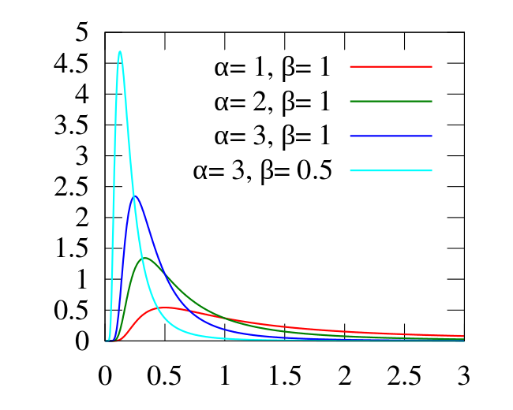
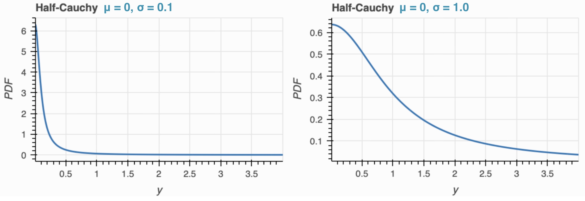

```{r setup, include=FALSE}
knitr::opts_chunk$set(echo = TRUE,
                      warning=FALSE,
                      message=FALSE)
```

## Topics 

- Get a brief introduction to Bayesian statistics and understand how it differs from the frequentist point of view. 
- Understand the difference between a credible interval and a confidence interval, particularly in how they can be interpreted.
- Understand how to create a Bayesian simple linear regression model with the `brms` package using different priors. 
- Understand how to create a Bayesian multiple linear regression model with the `brms` package using different priors.

## Installations and Data

This tutorial will make use of the following R libraries.

```{r load-libraries, warning=FALSE, message=FALSE}
library(dplyr)
library(brms)
library(knitr)
library(ggplot2)
library(patchwork)
library(pander)
library(tidyr)
library(broom.mixed)
```

This tutorial will be using the ``nhanes`` dataset where the variables are described in the file `nhanes-codebook.txt`. This data can be loaded with the `load` function, specifying the rda data file. 

```{r load-data}
load(file = 'nhanes1518.rda')
```

## Introduction to Bayesian Statistics

### Priors and Posteriors

There are two schools of thought in the world of statistics: frequentist, which we have been working with up to this point, and Bayesian. In the frequentist school, probability is defined as a frequency. For example, if we roll a fair six-sided die, the probability we will roll a 1 is $P(Y = 1) = \frac{1}{6}$. The conclusions we make in frequentist statistics are based on likelihood; we retrieve data and then make an inference based on the data.

In the Bayesian school, probability is defined as a belief. For example, a Bayesian statement could be "I believe the probability that it rains tomorrow is 30%." Different people obviously have different beliefs, so another statistician stating "I believe the probability that it rains tomorrow is 40%" is just as valid. Like frequentist statistics, our conclusions rely on likelihood. However, unlike frequentists statistics, our conclusions also rely on another factor: our prior knowledge. When we collect data, we then use it to update our prior knowledge. For simplicity, we can simply refer to our prior knowledge that we wish to update as the **prior**. After we see our data,  we update our prior to create the **posterior**.

But how exactly do we get from the prior to the posterior?

### Bayes' Rule

The fundamental concept of Bayesian statistics is the fittingly-named **Bayes' rule**. Given a **likelihood function** $p(y | \theta)$ and a prior $p(\theta)$, the posterior $p(\theta | y)$ stated by Bayes' rule is $p(\theta | y) = \frac{p(y | \theta)p(\theta)}{p(y)}$. 

For example, we can use the Bayes' rule with our `nhanes` dataset to calculate the probability that a subject in the dataset is female given their reported concentration of Mono(carboxynonyl) phthalate is above 10 ng/mL. For simplicity, we will only consider subjects with data points present for both the `RIAGENDR` and `URXCNP` variables, which deal with gender and Mono(carboxynonyl) phthalate concentration, respectively.

```{r filter-out-nulls}
bayesrule_ex <- nhanes1518 %>%
  filter(!is.na(RIAGENDR) & !is.na(URXCNP))
```

Let $F$ be the event in which a subject in the dataset is female, and let $M$ be the event in which a subject's concentration of Mono(carboxynonyl) phthalate is above 10 ng/mL. Then, to find $P(F | M)$, we need to calculate $P(F)$, $P(M)$, and $P(M | F)$.

```{r bayes-components}
female <- bayesrule_ex %>% filter(RIAGENDR == 2)
high_concentration <- bayesrule_ex %>% filter(URXCNP > 10)
female_and_high_concentration <- female %>% filter(URXCNP > 10)

p_f = nrow(female) / nrow(bayesrule_ex)
p_m = nrow(high_concentration) / nrow(bayesrule_ex)
p_m_given_f = nrow(female_and_high_concentration) / nrow(female)
```

We can then calculate $P(F | M)$ using Bayes' rule; we can confirm this value is correct by also calculating $P(F | M)$ using row counts.

```{r bayes-calculation}
p_f_given_m_bayes = p_m_given_f * p_f / p_m
p_f_given_m_bayes

p_f_given_m_rowcounts = nrow(female_and_high_concentration) / nrow(high_concentration)
p_f_given_m_rowcounts
```

We get that, given a subject's reported concentration of Mono(carboxynonyl) phthalate is above 10 ng/mL, the probability they will be female is approximately 46.7%.

### Credible Intervals

When conducting hypothesis tests or linear regressions using the frequentist approach, we often find it useful to create a **confidence interval**. Confidence intervals help us estimate the (un)certainty of a parameter with a lower and upper bound. For example, let's say we created a 95% confidence interval for the mean age in our dataset and found the lower bound to be 32 and the upper bound to be 47. We could then interpret this confidence interval as "We are 95% confident that the true mean age is between 32 and 47 years old." If we constructed many more similar confidence intervals, we would expect 95% of them to contain the true population mean.

The Bayesian equivalent to a confidence interval is known as a **credible interval**, which has a simpler interpretation. For example, a 95% credible interval is between any lower bound $L$ and any upper bound $U$ such that the posterior probability of $L < p < U = 0.95$. This means that if we found the 95% credible interval for the mean age in our dataset to have a lower bound of 32 and an upper bound of 47, then we can simply say that "There is a 95% probability that the true mean age is between 32 and 47 years old."

## Bayesian Simple Linear Regression

### Notation, Parameters, and Assumptions

In statistics, we use **linear regression** to model the relationship between a **response variable** and one or more **explanatory variables**. Linear regression is done differently in frequentist statistics and Bayesian statistics.

In **simple linear regression**, we have one explanatory variable. Simple linear regression takes the form $y = \beta_0 +\beta_1 x +\epsilon$, where $y$ is the response variable, $x$ is the explanatory variable, $\beta_1$ is the true slope of the relationship between $x$ and $y$, $\beta_0$ is the true intercept of the relationship between $x$ and $y$, and $\epsilon$ is the random error term.

```{r image1, echo=FALSE}

```

In frequentist statistics, linear regression uses point estimates for parameters $\beta_0$ and $\beta_1$ in order to help predict the value of the response variable based on the explanatory variable. The formula for **Bayesian regression** may appear to be the same, but now, our parameters are drawn from probability distributions. If we have a vague prior, we will have weak correlations between the independent and dependent variables. This explains the lack of steepness in the lines on the Bayesian graph in the visualization above. After we see the data and update our prior, we will begin to see stronger correlations between the variables. 

The assumptions for Bayesian linear regression are the same for the frequentist method, being as follows:
 -**linearity**: The relationship between the response and explanatory variables is linear.
 -**independence**: The observations are independent of each other, meaning that the results for one observation are not influenced by the results of any other observation.
 -**homoscedasticity**: The variance of the errors is constant for all values of the explanatory variables.
 -**normality**: The errors are normally distributed.
 -no **multicollinearity**: The explanatory variables are not highly correlated with each other.
 -no **autocorrelation**: The errors are not correlated with each other.
 
It is important that these assumptions are not violated to preserve the validity of the regression model. Later, we will learn how to verify that our model fits these assumptions.

### Motivation

As discussed earlier, we perform simple linear regression when we want to explore the relationship between one explanatory variable and one response variable. For example, we might want to better understand the relationship between body mass index and age for a variety of reasons--perhaps we want to know if different age groups are more prone to obesity. We can help answer this question with a simple linear regression model using the `nhanes` dataset. 

For this linear model, we want to predict age based on body mass index; therefore, we will use `RIDAGEYR` as our response variable and `BMXBMI` as our explanatory variable. We will limit our analysis to adults.

```{r filter-to-adults}
nhanes1518 <- nhanes1518 %>% 
  filter(RIDAGEYR >= 18)
```

### Model

We will use the `brms` library to create our Bayesian model. An important part of creating a Bayesian regression model is establishing our priors for the parameters. Based on our prior knowledge of the data, there is a variety of priors we can set (and thus a variety of models we can create). Later, we will discuss strategies for selecting model priors. For now, we will assume that we have no prior knowledge of the dataset, using a noninformative prior (the default prior in `brms`). We can use the `brm` function to create our model. The `formula` argument of this function follows the format `y ~ x`, with `y` being the response variable and `x` being the explanatory variable. We will save our model in a variable named `model1`.

```{r noninformative, echo = T, results = 'hide', warning = F, message = F}
model1 <- brm(formula = RIDAGEYR ~ BMXBMI, 
             data    = nhanes1518,
             seed    = 123)
```

### Interpretation

Once we have created our model, we will then interpret its results. We can use the `summary` function to view more detailed statistics of our model. We will set the `priors` argument to `TRUE` so that the summary includes the prior distributions we used for our model.

```{r noninformative-summary}
summary(model1, priors = TRUE)
```

The main areas we want to examine are the `Intercept` and `BMXBMI` columns. These tell us that our estimate for the intercept is 45.41, and the estimate for our slope is 0.12. With these statistics, let's now fill in our model:

$$\hat{\beta_{Age}} = 45.41 + 0.12(\hat{\beta_{BMI}}) + \epsilon$$

We can interpret the estimate of the slope to mean that for every 1 point increase in BMI, we expect age to increase by 0.12 years on average. The intercept does not have a meaningful interpretation in this case as it assumed a person with a BMI of 0, which is unrealistic. 

### Inference

Now that we have an estimate for our slope, we might want to conclude whether there is a statistically significant relationship between age and BMI. To do so, we can examine whether or not $\hat{\beta_{BMI}}$ is statistically different from 0. Our **null hypothesis** in this case is that the slope is equal to 0, while our **alternative hypothesis** is that the slope is not equal to 0 (which implies a linear relationship between age and BMI). We can answer this question with credible intervals. 

Going back to our model summary, we can look at the `l-95% CI` and `u-95% CI` columns to obtain 95% credible intervals for our intercept and estimates: we can thus state that there is a 95% chance that the true value for the intercept lies between 43.94 and 46.87, and there is a 95% chance that the true value for $\beta_{BMI}$ lies between 0.07 and 0.16. Since the confidence interval for `BMXBMI` does not include 0, we can reject our null hypothesis and conclude that there is likely a linear relationship between body mass index and age.

### Prediction

Suppose we want to guess an individual's age using our model. We can do this with a **prediction interval**; it differs from using normal confidence intervals as confidence intervals only express sampling uncertainty from our data. On the other hand, prediction intervals express sampling uncertainty from our data and from the single value with which we want to predict. As a result, prediction intervals are wider than confidence intervals.

We can use the `predict` function with our model to predict individual's ages given a BMI of 20, 25, and 30.

```{r predict}
predict(model1, data.frame(BMXBMI = (c(20, 25, 30))), interval = "prediction")
```

Our prediction interval estimates that an individual with a BMI of 20 is likely between 11.39 and 83.98 years old. As we can see, the interval is extremely wide, limiting our ability to make meaningful conclusions; this is likely because the relationship between age and BMI is weak.

### Evaluation

### Coefficient Priors: The Normal Distribution

A common prior for the coefficient (or $\beta$) in Bayesian inference deals with a **normal (Gaussian) distribution**. This is a **conjugate** prior, meaning that the posterior will also be a normal distribution, but with different parameters. This might be a good choice for our beta prior if we assume our data is normally distributed, meaning most values are situated in the middle, and there is a symmetrical decline in the frequency of values as we reach the ends. 

Since we have thousands of observations in our dataset, it may be reasonable to assume that `BMXBMI` is normally distributed. We can use the `prior` parameter in the `brm` function to set our prior for $\beta$.

```{r model2, echo = T, results = 'hide', warning = F, message = F}
model2 <- brm(formula = RIDAGEYR ~ BMXBMI, 
             data    = nhanes1518,
             prior   = c(set_prior("normal(0, 0.3)", class = "b", coef = "BMXBMI")),
             seed    = 123)
```

```{r model2-summ}
summary(model2, priors = TRUE)
```

As we see from the summary, the estimates for the intercept and $\beta_{BMI}$ have changed slightly from our previous model, demonstrating how different priors can yield different results. 

Let's run another model with a normally distributed Beta prior, using the same mean but inputting a much larger variance:

```{r model3, echo = T, results = 'hide', warning = F, message = F}
model3 <- brm(formula = RIDAGEYR ~ BMXBMI, 
             data    = nhanes1518,
             prior   = c(set_prior("normal(0, 100)", class = "b", coef = "BMXBMI")),
             seed    = 123)
```

```{r model3-summ}
summary(model3, priors = TRUE)
```

As you can see, we get extremely comparable results to the previous two models despite drastically changing the variance. In Bayesian regression, the impact of the prior will be rather small if we are working with a large dataset (which is the case of `nhanes`, having n = 11848). If we are using a smaller dataset, our choice of prior will have a much more considerable impact on the posterior. 

Let's recap the models we've created so far with their results:

```{r model-recap1, echo = F, warning = F, message = F}
beta_dists <- c('Default', 'N(0, 0.09)', 'N(0, 10000)')
post_means <- c('0.12', '0.11', '0.12')
post_inters <- c('45.41', '45.43', '45.41')
model_recap1 <- data.frame(beta_dists, post_means, post_inters)
kable(model_recap1, col.names = c("$\\beta_{BMI}$ Distributions",
                           "Posterior Means",
                           "Intercepts"))
```

### Coefficient Priors: The T-Distribution

Another common prior for the coefficient in Bayesian inference deals with the **student t-distribution**. This differs from the normal distribution in that the values are less clustered in the middle, giving it heavier tails on the ends. Using the t-distribution can offer more robust estimation; it is often used on smaller, approximately normal datasets (for example, when n < 30). For the purpose of this section, we will proceed using a t-distribution to estimate $\beta_{BMI}$.

We can change the shape of our t-distribution by altering the **degrees of freedom**; the more degrees of freedom we have, the more we will resemble a normal distribution (so, the less heavy the tail ends will be). Let's fit a model with a beta prior distributed as a unit t-distribution with 3 degrees of freedom:

```{r model4, echo = T, results = 'hide', warning = F, message = F}
model4 <- brm(formula = RIDAGEYR ~ BMXBMI, 
             data    = nhanes1518,
             prior   = c(set_prior("student_t(3, 0, 1)", class = "b", coef = "BMXBMI")),
             seed    = 123)
```

```{r model4-summ}
summary(model4, priors = TRUE)
```

Again, our model results resemble those we have previously calculated. For demonstrative purposes, let's also run a model with more degrees of freedom (a more Gaussian-like distribution):

```{r model5, echo = T, results = 'hide', warning = F, message = F}
model5 <- brm(formula = RIDAGEYR ~ BMXBMI, 
             data    = nhanes1518,
             prior   = c(set_prior("student_t(10000, 0, 1)", class = "b", coef = "BMXBMI")),
             seed    = 123)
```

```{r model5-summ}
summary(model5, priors = TRUE)
```

And now let's once again recap our models:

```{r model-recap2, echo = F, warning = F, message = F}
beta_dists <- c('Default', 'N(0, 0.09)', 'N(0, 10000)',
                'StudentT(3, 0, 1)', 'StudentT(10000, 0, 1)')
post_means <- c('0.12', '0.11', '0.12', '0.11', '0.12')
post_inters <- c('45.41', '45.43', '45.41', '45.42', '45.38')
model_recap2 <- data.frame(beta_dists, post_means, post_inters)
kable(model_recap2, col.names = c("$\\beta_{BMI}$ Distributions",
                           "Posterior Means",
                           "Intercepts"))
```

Upon selecting our priors and running our models, we can then use our posterior information to conduct further regression. Usually, regardless of the initial choice of prior, results will end up converging to the same posterior after many iterations.

### Coefficient Priors: A Closer Look

In the previous sections, we have discovered that, regardless of our choice of prior, we get virtually identical results for the posterior means and intercepts. To get a better understanding of how prior selection can impact our regression models, let's take a small sample of our overarching `nhanes` dataset.

```{r sample-subset}
set.seed(456)
nhanes1518_sample <- sample_n(nhanes1518, 30)
```

First, let's visualize the distribution of the `BMXBMI` variable in our new dataset:

```{r bmi-dist-sample, fig.height = 3}
ggplot(nhanes1518_sample, aes(x = BMXBMI)) + 
  geom_boxplot(color = "black", fill = "white") +
  labs(title = 'Distribution of BMI in Sample Dataset')
```

Now, let's rerun the five models we have examined so far with our updated dataset. We will recap our results in a summary table.

```{r model6, echo = T, results = 'hide', warning = F, message = F}
model6 <- brm(formula = RIDAGEYR ~ BMXBMI, 
             data    = nhanes1518_sample,
             seed    = 123)
```

```{r model7, echo = T, results = 'hide', warning = F, message = F}
model7 <- brm(formula = RIDAGEYR ~ BMXBMI, 
             data    = nhanes1518_sample,
             prior   = c(set_prior("normal(0, 0.3)", class = "b", coef = "BMXBMI")),
             seed    = 123)
```

```{r model8, echo = T, results = 'hide', warning = F, message = F}
model8 <- brm(formula = RIDAGEYR ~ BMXBMI, 
             data    = nhanes1518_sample,
             prior   = c(set_prior("normal(0, 100)", class = "b", coef = "BMXBMI")),
             seed    = 123)
```

```{r model9, echo = T, results = 'hide', warning = F, message = F}
model9 <- brm(formula = RIDAGEYR ~ BMXBMI, 
             data    = nhanes1518_sample,
             prior   = c(set_prior("student_t(3, 0, 1)", class = "b", coef = "BMXBMI")),
             seed    = 123)
```

```{r model10, echo = T, results = 'hide', warning = F, message = F}
model10 <- brm(formula = RIDAGEYR ~ BMXBMI, 
             data    = nhanes1518_sample,
             prior   = c(set_prior("student_t(10000, 0, 1)", class = "b", coef = "BMXBMI")),
             seed    = 123)
```

```{r model6-summ, echo = F, results = 'hide'}
summary(model6, priors = TRUE)
```

```{r model7-summ, echo = F, results = 'hide'}
summary(model7, priors = TRUE)
```

```{r model8-summ, echo = F, results = 'hide'}
summary(model8, priors = TRUE)
```

```{r model9-summ, echo = F, results = 'hide'}
summary(model9, priors = TRUE)
```

```{r model10-summ, echo = F, results = 'hide'}
summary(model10, priors = TRUE)
```

```{r model-recap3, echo = F, warning = F, message = F}
beta_dists <- c('Default', 'N(0, 0.09)', 'N(0, 10000)',
                'StudentT(3, 0, 1)', 'StudentT(10000, 0, 1)')
post_means <- c('-0.51', '-0.18', '-0.52', '-0.42', '-0.44')
post_inters <- c('68.94', '58.90', '69.34', '66.05', '66.94')
model_recap3 <- data.frame(beta_dists, post_means, post_inters)
kable(model_recap3, col.names = c("$\\beta_{BMI}$ Distributions",
                           "Posterior Means",
                           "Intercepts"))
```

We now see notable differences in our posterior results. Notice specifically how the model with the $\beta{BMI} ~ N(0, 0.09)$ parameter sticks out from the rest--this is likely because of the prior's extremely small variance, which forces the prior to very sharply fit the data. 

As we saw in the visualization of the BMI distribution in our sample, the data is heavily skewed right and ranges from under 20 to over 50. Since our sample size is now very small (n = 30), it might be more intelligent to use a student-t distribution for our $\beta_{BMI}$ parameter.  

### Variance Priors: The Inverse-Gamma

```{r image2, echo=FALSE}

```

Now let's move on to our variance (or $\sigma^2$) parameter. A common prior for the variance in Bayesian inference deals with the **inverse gamma distribution**. This particular distribution restricts the variance to only positive values (we cannot have a negative variance as it is the value of the standard deviation squared.) The inverse gamma distribution takes two parameters, $\alpha$ and $\beta$, which impact the shape (different permutations of these parameters are pictured above.)

Let's run two models with inverse-gamma variance priors, using the parameters of the light blue line and the red line in the visualization above. We will use our `nhanes1518_sample` dataset that we created in the previous section.

```{r model11, echo = T, results = 'hide', warning = F, message = F}
model11 <- brm(formula = RIDAGEYR ~ BMXBMI, 
             data    = nhanes1518_sample,
             prior   = c(set_prior("inv_gamma(3, 0.5)", class = "sigma")),
             seed    = 123)
```

```{r model11-summ, echo = F, results = 'hide'}
summary(model11, priors = TRUE)
```

```{r model12, echo = T, results = 'hide', warning = F, message = F}
model12 <- brm(formula = RIDAGEYR ~ BMXBMI, 
             data    = nhanes1518_sample,
             prior   = c(set_prior("inv_gamma(1, 1)", class = "sigma")),
             seed    = 123)
```

```{r model12-summ, echo = F, results = 'hide'}
summary(model12, priors = TRUE)
```

### Variance Priors: The Half-Cauchy Distribution

```{r image3, echo=FALSE}

```

Another common prior for the variance in Bayesian inference deals with the **Half-Cauchy distribution**. The Cauchy distribution is equivalent to a student t-distribution with 1 degree of freedom. We then restrict this to only contain positive values (as again, our variance cannot be negative) to get the Half-Cauchy distribution. The Half-Cauchy takes two parameters, $\mu$ and $\sigma$, which impact the shape (two permutations of these parameters are pictured above.) 

Let's run two models with Half-Cauchy variance priors, using the parameters of the two examples pictured above. We will continue to use our `nhanes1518_sample` dataset. If we specify our `sigma` prior to be a `cquchy`, the `brms` package will automatically restrict it to positive values, thus effectively making it a Half-Cauchy. 

```{r model13, echo = T, results = 'hide', warning = F, message = F}
model13 <- brm(formula = RIDAGEYR ~ BMXBMI, 
             data    = nhanes1518_sample,
             prior   = c(set_prior("cauchy(0, 0.1)", class = "sigma")),
             seed    = 123)
```

```{r model14, echo = T, results = 'hide', warning = F, message = F}
model14 <- brm(formula = RIDAGEYR ~ BMXBMI, 
             data    = nhanes1518_sample,
             prior   = c(set_prior("cauchy(0, 1)", class = "sigma")),
             seed    = 123)
```

```{r model13-summ, echo = F, results = 'hide'}
summary(model13, priors = TRUE)
```

```{r model14-summ, echo = F, results = 'hide'}
summary(model14, priors = TRUE)
```

Let's summarize the results from all of our variance models in a table:

```{r model-recap4, echo = F, warning = F, message = F}
var_dists <- c('Default', 'InvGam(3, 0.5)', 'InvGam(1, 1)',
                'HalfCauchy(0, 0.1)', 'HalfCauchy(0, 1)')
post_means <- c('-0.51', '-0.53', '-0.51', '-0.53', '-0.53')
post_inters <- c('68.94', '69.41', '69.04', '69.61', '69.51')
model_recap4 <- data.frame(var_dists, post_means, post_inters)
kable(model_recap4, col.names = c("$\\sigma$ Distributions",
                           "Posterior Means",
                           "Intercepts"))
```

## Bayesian Multiple Linear Regression

### Motivation

### Model

### Interpretation

### Inference

### Prediction

### Evaluation

Now that we've tackled simple linear regression, let's learn how to do **multiple linear regression** the Bayesian way. In our frequentist regression module, we fit a model with `BMXBMI` as the response and `RIDAGEYR`, `BMXWAIST`, `BMXWT`, and `BMXHT` as the predictors; we will follow that formula here.

We will continue to use the `nhanes1518_sample` dataset that we created in the last section. First, let's visualize the distribution of all of our predictor variables in the dataset.

```{r predictor-dists, fig.height = 3}
p1 <- ggplot(nhanes1518_sample, aes(x = RIDAGEYR)) + 
  geom_histogram(color = "black", fill = "red") +
  labs(title = 'Distribution of Age in Sample Dataset')

p2 <- ggplot(nhanes1518_sample, aes(x = BMXWAIST)) + 
  geom_histogram(color = "black", fill = "blue") +
  labs(title = 'Distribution of Waist Size in Sample Dataset')

p3 <- ggplot(nhanes1518_sample, aes(x = BMXWT)) + 
  geom_histogram(color = "black", fill = "yellow") +
  labs(title = 'Distribution of Weight in Sample Dataset')

p4 <- ggplot(nhanes1518_sample, aes(x = BMXHT)) + 
  geom_histogram(color = "black", fill = "green") +
  labs(title = 'Distribution of Height in Sample Dataset')

p1 + p2 + p3 + p4 + 
  plot_layout(ncol = 2)
```

As you can infer, our predictors are not measured in the same way; age is in years, waist and height are in centimeters, and weight is in kilograms. This leads to these predictors having different ranges (for example, age ranges from 18 to 80 while weight ranges from ~50 to ~160.) If we run a linear regression model, since weight ranges higher values, it could end up having a larger impact on our posterior (even though it may not necessarily be more influential.) To counteract this, we can use the `scale` function in R to normalize our data so that each predictor has a mean of 0 and a standard deviation of 1. 

```{r scale-data}
nhanes1518_sample['RIDAGEYR_sc'] <- scale(nhanes1518_sample$RIDAGEYR)
nhanes1518_sample['BMXWAIST_sc'] <- scale(nhanes1518_sample$BMXWAIST)
nhanes1518_sample['BMXWT_sc'] <- scale(nhanes1518_sample$BMXWT)
nhanes1518_sample['BMXHT_sc'] <- scale(nhanes1518_sample$BMXHT)
```

Again, we will begin by assuming we have no prior knowledge of the data and use the default the prior in `brms`. We will again use the `brm` function to create our model. 

```{r multi-model1, echo = T, results = 'hide', warning = F, message = F}
multi_model1 <- brm(formula = BMXBMI ~ RIDAGEYR_sc + BMXWAIST_sc + BMXHT_sc + BMXWT_sc, 
             data    = nhanes1518_sample,
             seed    = 123)
```

```{r multimodel1-summary}
summary(multi_model1, priors = TRUE)
```

From our model results, it appears that weight and height have the largest influence on BMI; this obviously makes intuitive sense, as BMI is calculated on these metrics. However, let's try setting priors for our $\beta$ coefficients and see how our results change.

In `brms`, we can set the prior for each coefficient separately. For this model, we will use a normal distribution prior for each $\beta$ with a mean of 0. Since we don't know much about the data, we want our prior to be relatively flat; thus we will use a relatively large variance of 100. We will also use a simple $HalfCauchy(0, 1)$ prior for sigma, and a very flat $N(0, 500)$ prior for the intercept.

After we create our model, we will compare the results of the two models in a summary table.

```{r multi-model2, echo = T, results = 'hide', warning = F, message = F}
priors2 <- c(set_prior("normal(0, 10)", class = "b", coef = 'RIDAGEYR_sc'),
             set_prior("normal(0, 10)", class = "b", coef = 'BMXWT_sc'),
             set_prior("normal(0, 10)", class = "b", coef = 'BMXWAIST_sc'),
             set_prior("normal(0, 10)", class = "b", coef = 'BMXHT_sc'),
             set_prior("cauchy(1, 1)", class = "sigma"),
             set_prior("normal(0, 22.3607)", class = "Intercept"))

multi_model2 <- brm(formula = BMXBMI ~ RIDAGEYR_sc + BMXWAIST_sc + BMXHT_sc + BMXWT_sc, 
             data    = nhanes1518_sample,
             prior   = priors2,
             seed    = 123)
```

```{r multimodel2-summary, echo = F, results = 'hide'}
summary(multi_model2, priors = TRUE)
```

```{r model-recap5, echo = F, warning = F, message = F}
prior_dists <- c('Default Priors', 'Specified Priors')
post_ages <- c('-0.15', '-0.17')
post_waists <- c('0.65', '0.68')
post_heights <- c('-2.76', '-2.76')
post_weights <- c('9.44', '9.41')
post_inters <- c('30.18', '30.19')
model_recap5 <- data.frame(prior_dists, post_ages, post_waists, post_heights,
                           post_weights, post_inters)
kable(model_recap5, col.names = c("Distributions",
                           "Posterior $\\beta_{AGE}$",
                           "Posterior $\\beta_{WAIST}$",
                           "Posterior $\\beta_{HEIGHT}$",
                           "Posterior $\\beta_{WEIGHT}$",
                           "Intercepts"))
```

As we can see, the results of both models are very similar. This makes sense, as all of our specified priors in the second model were very unspecific (due to large variances.) If we fit sharper priors, we could expect to see a larger difference in the posterior from the default model.

## Prior Selection


## Model Evaluation

In the prior sections, we have fit a variety of models with different priors to examine linear relationships in the `nhanes` dataset. Now, it's time to put some of our models to the test to see how they compare in performance and predictive ability.

### MCMC Diagnostics & Trace Plots

In order to see if our Bayesian analysis is working and performing well, we need to examine **Markov Chain Monte Carlo (MCMC) diagnostics**. In statistics, the Monte Carlo method refers to when we generate a sample of independent draws from the probability distribution of a random variable $X$ in order to estimate a feature of that distribution. The Markov Chain Monte Carlo method is similar, but in this case the items in the generated sample are serially correlated rather than independent. During model evaluation, samples from our posterior distributions will be generated using the MCMC method; we then can use **trace plots** to examine if our model meets MCMC diagnostics. Trace plots are line charts showing time on the x-axis, and values from the sample draws on the y-axis. We can use the `plot()` method in the `brms` package to display trace plots.

Let's first examine a model that passes MCMC diagnostics. We will continue to use the `nhanes1518_sample` dataset, and we will focus on simple linear regression models.

```{r mcmc1, echo = T, results = 'hide', warning = F, message = F}
mcmc1 <- brm(formula = RIDAGEYR ~ BMXBMI, 
             data    = nhanes1518_sample,
             seed    = 123)
```

```{r mcmc1-trace}
plot(mcmc1)
```

The plots on the right side are the trace plots. We want to see something that represents a fuzzy caterpillar; this means that the generated draws have low serial correlation and that the sample space is explored many times. All three of our trace plots for this model fit the criteria. We can also do `summary(mcmc1)` and look at the values in the Rhat column; a value of 1 means our Markov chains have converged sufficiently, which is what we are looking for.

Now, let's examine some models that fail MCMC diagnostics. Let's run the same model as the previous example, but set the `iter` parameter to equal 100 (`brms` defaults this parameter to 2000.)

```{r mcmc2, echo = T, results = 'hide', warning = F, message = F}
mcmc2 <- brm(formula = RIDAGEYR ~ BMXBMI, 
             data    = nhanes1518_sample,
             seed    = 123,
             iter    = 50)
```

```{r mcmc2-trace}
plot(mcmc2)
```

Here, we see our trace plots look vastly different than the ones in the `iter = 2000` example. With plots like this, we can infer that the generated draws have high serial correlations and that the chains are failing to explore the sample space as frequently. This means that the effective size of our sample is too small; we can fix this issue by increasing the number of iterations (in this case, changing the `iter` parameter when fitting our model.)

For this next model, we will use the same structure as the previous two models, except we will set the `iter` parameter to 400 and the `warmup` to 10 (the `warmup` parameter defaults to `iter/2`.)

```{r mcmc3, echo = T, results = 'hide', warning = F, message = F}
mcmc3 <- brm(formula = RIDAGEYR ~ BMXBMI, 
             data    = nhanes1518_sample,
             seed    = 123,
             iter    = 400,
             warmup  = 10)
```

```{r mcmc3-trace}
plot(mcmc3)
```

Here, we see that the first portions of the trace plots look very different than the rest; this means our chains are eventually converging to the target distribution (as we get to the 'fuzzy caterpillar' portion), but our initial distributions are largely different than the target. We can fix this by increasing the `warmup` parameter, which discards a number of the initial observations.

### Widely Applicable Information Criterion (WAIC)

One metric we can use to compare Bayesian models is the **Widely Applicable Information Criterion (WAIC)**, which is an extension of the AIC metric. This statistic is a measurement of prediction error, and therefore we want to choose the model with the smallest WAIC.

Let's compare the three models we just used to evaluate MCMC diagnostics. We can visualize their WAIC values, which are calculated using the `waic()` method in the `brms` package.

```{r waic-comparisons}
waic1 <- waic(mcmc1)$waic
waic2 <- waic(mcmc2)$waic
waic3 <- waic(mcmc3)$waic
wx <- c(waic1, waic2, waic3)
barplot(wx, ylab = "WAIC", names.arg=paste("mcmc", 1:3))
```

We see that the WAIC for mcmc1 is the lowest. This makes intuitive sense, as this was the model that passed MCMC diagnostics. If we were comparing these three models, we would proceed with mcmc1.

We can also use WAIC to determine what are the best priors to select for our data. Let's take a look at the first five models we fitted in this module, using the `nhanes1518_sample` dataset. Here's a reminder of their prior distributions and their posterior statistics:

```{r model-reminder, echo = F, warning = F, message = F}
kable(model_recap3, col.names = c("$\\beta_{BMI}$ Distributions",
                           "Posterior Means",
                           "Intercepts"))
```

```{r waic-comparisons-2}
waic_mod6 <- waic(model6)$waic
waic_mod7 <- waic(model7)$waic
waic_mod8 <- waic(model8)$waic
waic_mod9 <- waic(model9)$waic
waic_mod10 <- waic(model10)$waic
wy <- c(waic_mod6, waic_mod7, waic_mod8, waic_mod9, waic_mod10)
barplot(wy, ylab = "WAIC", ylim = c(230, 233), names.arg=paste("model", 6:10))
```

Although all of the models have very similar WAIC scores, model 7 (which uses a $N(0, 0.9)$ prior for $\beta_{BMI}$) slightly edges out the others. We would proceed with model 7. 

## References

https://www.statlect.com/fundamentals-of-statistics/Markov-Chain-Monte-Carlo-diagnostics
https://bookdown.org/ajkurz/Statistical_Rethinking_recoded/markov-chain-monte-carlo.html
https://tem11010.github.io/regression_brms/
https://cran.r-project.org/web/packages/bayesplot/vignettes/visual-mcmc-diagnostics.html
https://www.r-bloggers.com/2019/11/creating-and-using-a-simple-bayesian-linear-model-in-brms-and-r/
https://mc-stan.org/docs/2_21/functions-reference/inverse-gamma-distribution.html
https://solomonkurz.netlify.app/post/2019-07-13-would-you-like-all-your-posteriors-in-one-plot/
https://rstudio-pubs-static.s3.amazonaws.com/157909_f020eeb816364e18a75a3d866f3464e6.html
https://michael-franke.github.io/intro-data-analysis/setting-priors.html
https://www.rensvandeschoot.com/tutorials/r-linear-regression-bayesian-using-brms/
https://statswithr.github.io/book/introduction-to-bayesian-regression.html#sec:Bayes-multiple-regression
https://rpubs.com/katzkagaya/460937
https://gregorygundersen.com/blog/2020/02/04/bayesian-linear-regression/