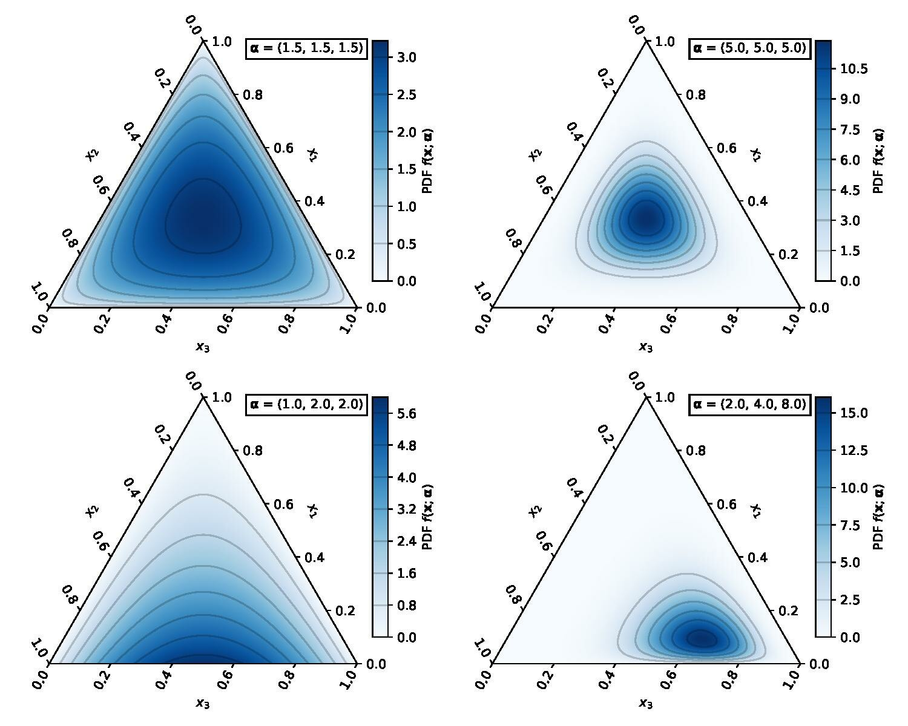
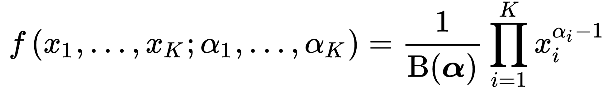

Bayesian Weighted Sums (BWS) is a Bayesian version of Weighted Quantile Sums Regression, which reweights quantiles of predictors and regresses the sum of weighted predictors on the outcome. Unlike WQS/qgcomp which is based on frequentist methods, BWS is a Bayesian method which integrates insights from data to update prior knowledge, and make inference based on posterior. shares many similarities with Weighted Quantile Sums (WQS) and quantile g-computation (qgcomp). Similar to weighted quantile sums regression, BWS helps summarize the impact of highly correlated predictors and evaluate the importance of each predictor. In addition, Bayesian methods provide a more natural way to address the restriction (weights sum up to 1) in the model fitting, and is flexible to incorporate our prior knowledge, and also provide a uncertainty quantification for weights.

In this tutorial, we are interested in predicting log BMI using phalate measurements from urine samples for individuals above 18 years of age.

## Preparation

In this tutorial, we will use the BWQS package, which can be installed from GitHub running the following lines in the Console.

```{r}
#| message: false
# Additional installations may be necessary for installing bwqs, which can be loaded using the additional code below:
#install.packages("clusterGeneration")

# install BWQS package
#devtools::install_github("ElenaColicino/bwqs", build_vignettes = TRUE)

# loading packages
library(BWQS)
library(tidyverse)
```

Similar to previous tutorials, we will use datum from NHANES and look at participants who are over 18 years old and will take the natural log of BMI. Phalates will be analyzed similar to the greater.

```{r}
load(file='nhanes1518.rda')
head(nhanes1518)
```

```{r}
test <- nhanes1518|>
  dplyr::select(BMXBMI, URXMHBP, URXMOH, URXMHP, URXMHH, URXMCOH, URXMHNC, URXMHH, URXECP, URXHIBP, URXMIB, RIDAGEYR)
```

Below, we remove the participants under the age of eighteen and take the log of BMI.

```{r}
nhanes <- nhanes1518 |>
    filter(RIDAGEYR >= 18)|>
    mutate(BMXBMIlog = log(BMXBMI),
          RIDAGEYR = RIDAGEYR - 18)|>
    dplyr::select(BMXBMI, BMXBMIlog, URXMHBP, URXMOH, URXMHP, URXMHH, URXMCOH, URXMHNC, URXMHH, URXECP, URXHIBP, URXMIB, RIDAGEYR)
# We specify the select function comes from package `dplyr` by using `dplyr::select`
nhanes <- drop_na(nhanes)

nhanes
```

## Bayesian Weighted Sums

\*\*INTRODUCE THE MODEL

$$ Eg(Y)= \beta_0 + \beta_1  \times (w_1X_1 + w_2X_2 +...+w_nX_n) $$

In this model, beta 1 is the combined effect of the three mixture exposures, while w is each individual weight. In this model, weights (w1,w2,...,wn) to must sum to 1.

Weighted quantile sum regression has several foundations that are essential to BWS: A weighted quantile sum regression has two core differences compared to an ordinary regression. First, it uses quantiles instead of its original scales as predictors, where X takes values as quantiles. Second, it contains a weighted sum, which poses a constraint on the weights coefficients that should sum up to 1, w1 + w2 + … + wq = 1. Since the posterior has the same support as that of the prior, such constraint on weights is easily addressed in Bayesian methods by specifying a prior on weights subject to the constraint.The prior commonly used with BWS is Dirichlet distribution. The Dirichlet is generalized from the beta distribution and is a continuous and multivariate probability distribution.

Parameters of the distribution are α1, α2, ..., αK where K is are greater than or equal to 2:

{width="469"}

As shown above in the image, when alphas are equal, the resulting weights will be equal. However, if the alphas are unbalanced, there must be prior knowledge. We can assign unequal weights if we have strong prior knowledge showing some of predictors have more potential impact than the others. We can also adjust the amplitude of alpha to indicate the degree of confidence we have on prior knowledge. By default, we set all alpha’s to 1, indicating we the predictors have the same importance and we have weak information.

Therefore, we can generalize the formula for the Dirichlet Distribution where B(α) is the (multivariate) beta distribution:

{width="294"}

It is important to note, the assumptions for the Dirichlet distribution include all weights must be positive, real numbers and must sum to 1. Despite the constraints on the weights, the overall estimate (𝜃1) can be any value.

Another useful method for Bayesian Weighted Sums is that the unidirectional assumption (which has been discussed in previous tutorials) can be accounted for. Instead of constraining all exposures to contribute to a single direction, a grouping method of variables can be used accounting for a positive and negative beta one.

## Model Fitting

`BWQS` has similar arguments to the `gWQS` and `qgcomp` packages:

`q` - specifies the number of quantiles to be used

`iter` - the number of iterations in the model (default 10,000)

`chains` - number of chains in the Monte Carlo algorithm (default 1)

`thin` - the thinning parameter in the Monte Carlo algorithm (integer)

`prior` - the direction of the prior distribution ("None" default, "Positive", "Negative)

It is important to note that the prior of the beta-1 coefficient can be manually set to either the positive or negative direction. This can be useful if we have specific information regarding the prior and is accomplished by writing prior = "positive" or prior = "negative".

```{r}

chem_names_new <- c('URXMHBP', 'URXMOH',  'URXMHP',  'URXMHH',  'URXMCOH', 'URXMHNC', 'URXECP', 'URXHIBP', 'URXMIB')

nhanes_s = sample_n(tbl = nhanes,size = 50,replace = FALSE)

fit_bwqs = bwqs(BMXBMIlog~RIDAGEYR, mix_name = chem_names_new,
                data = nhanes_s, q = 4, family = "gaussian",iter = 100)
```

## Model Interpretation and Inference

In addition to the model, the BWQS package has built-in visualization tools. Similar to WQS and GWQS, we can visualize the weights assigned to each of the predictors in our model.

```{r}
bwqs_plot(fit_bwqs, parms = "W", size = 2)
# set parms = "W" to only visualize credible intervals of weights.
```

Additionally, similar to standard Bayesian regression models, we can us a 95% credible interval to view the results. We want the credible interval corresponding to our beta1 value, as shown below. Note the small dots correspond to the median, the large dots are the mean, and the credible interval is displayed by a line.

```{r}
fit_bwqs$summary_fit
```

We can state that there is a 95% confident that the average BMI for an individual above the age of 18 lies between -0.05040 and 0.11400. It is important to note that if the credible interval includes 0, the relationship is not considered significant. In this example, 0 is contained within the interval, so we there is not sufficient evidence to conclude there is a relationship between the phalates and log BMI.

Also, we can interpret the beta 1 term for the model:

Beta 1: For every one unit increase in WQS (for every one increase in quantile of each chemical mixture), we expect a 0.03322 increase in log BMI.

Additional information provided by the model includes the standard error, the effective sample size (number of cases in the population), and R-hat which is the corresponds to the convergence of MCMC simulations. (LESS THAN 1.01)!!

## Model Prediction

When predicting using Bayesian methods, a **prediction interval** is used which accounts for sampling uncertainty from the data. Below, we can use phalate data to predict the log BMI for an individual above 18 years old:

```{r}
predict(fit_bwqs,
        newdata = data.frame(URXMHBP = c(1.5),URXMOH = c(12), URXMHP = c(0.75), URXMHH = c(1.5), URXMCOH = c(3), URXMHNC = c(14),URXECP = c(11.2),URXHIBP = c(1.7), URXMIB = c(5)),
        interval = "prediction",
        level = 0.95) |>
  knitr::kable(digits = 2)
```

The prediction interval estimates that for individuals over 18 years old likely has a BMI between \_\_\_\_\_ and \_\_\_\_.

## Model Evaluation

For the model evaluation, instead of using AIC for our model evaluation, we use WAIC, which is widely used with Bayesian regression models. We will create a second model predicting log BMI using age as a covariate.

```{r}
chem_names_newage <- c('URXMHBP', 'URXMOH',  'URXMHP',  'URXMHH',  'URXMCOH', 'URXMHNC', 'URXECP', 'URXHIBP', 'URXMIB','RIDAGEYR')

nhanes_samp = sample_n(tbl = nhanes,size = 50,replace = FALSE)

fit_bwqs_age = bwqs(BMXBMIlog~RIDAGEYR, mix_name = chem_names_newage,
                data = nhanes_samp, q = 4, family = "gaussian",iter = 100)
```

The WAIC metric from the model without the age covariate:

```{r}
bwqs_waic(fit_bwqs$fit)
```

The WAIC metric from the model with age as a covariate:

```{r}
bwqs_waic(fit_bwqs_age$fit)
```

## Conclusion

In all, the BWQS model has many similarities to WQS and QGCOMP. However, the Bayesian methods can be utilized allowing additional flexibility in the model. <https://rdrr.io/github/ElenaColicino/bwqs/f/vignettes/bwqs_vignette.Rmd>

## References

<https://www.ncbi.nlm.nih.gov/pmc/articles/PMC7289141/>

<https://www.ncbi.nlm.nih.gov/pmc/articles/PMC7913173/>

<https://en.wikipedia.org/wiki/Dirichlet_distribution>

<https://github.com/ElenaColicino/bwqs>

<https://stat.columbia.edu/~gelman/research/published/rhat.pdf>
