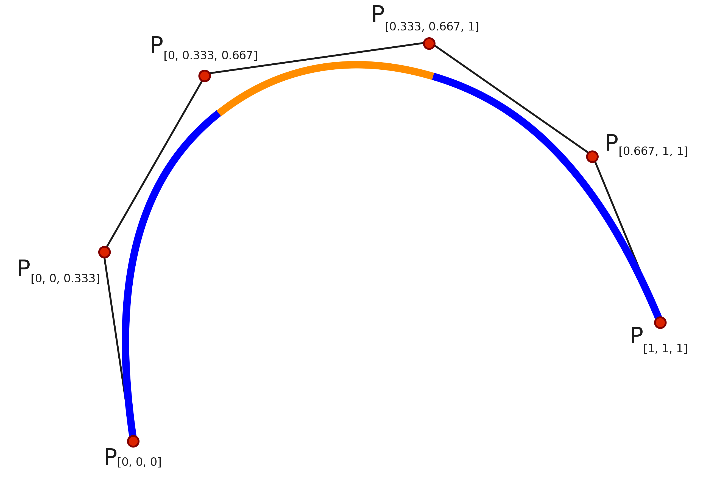

## qgcomp Package

Weighted Quantile Sum Regression (WQS) allows researchers to understand the effects of highly correlated components. In a previous tutorial, we used the `gWQS` package to implement modeling fitting, inference, and diagnostics. An additional method used to employ Weighted Quantile Sum Regression is the quantile g-computation. Quantile g-computation is firstly developed as a causal effect estimating method, and is implemented by `qgcomp` package. Quantile g-computation relaxes the **directional homogeneity assumption** of WQS, here the components do not have to contribute in the same direction. Compared to WQS, g-computation can provide unbiased estimation and appropriate confidence interval coverage. Additionally, compared to `gWQS` packge, `qgcomp` package has greater computation efficiency and it allows more flexibility on modeling non-linear relationship. 

In this tutorial, we will demonstrate how the `qgcomp` package can provide additional flexibility when analyzing chemical mixtures. Specifically, we will explore applications for (1) linear model (2) linear model with extra covariates (3) non-linear model (4) missing data, limits of detection, and multiple imputation.

## Libraries

For this tutorial, we will be using similar packages to the previous tutorials. Note that in addition to `qgcomp`, we will also use the `splines` package for [Non-Linear Models] later in the tutorial.

```{r}
#| message: false

#| install.packages("gWQS")
#| install.packages("qgcomp")
#| install.packages("corrplot")
#| install.packages("ggcorrplot")
#| install.packages("splines")
#| 
library(tidyverse)
library(tidymodels)
library(dplyr)
library(ggcorrplot)
library(corrplot)
```

## Exploratory Data Analysis

For this analysis, we will be using the `nhanes` dataset, which can be loaded into R studio.

```{r}
load(file='nhanes1518.rda')
head(nhanes1518)
```

Consistent with prior tutorials, we hope to study the impacts of specific chemical exposures (Phalates and Phytoestrogen) on log(BMI), for participants over 18. The `nhanes` data can be normalized through this method.

```{r}
nhanes <- nhanes1518 |>
    filter(RIDAGEYR >= 18)|>
    mutate(BMXBMIlog = log(BMXBMI),
          RIDAGEYR = RIDAGEYR - 18)|>
    select(BMXBMI, BMXBMIlog, URXMHBP, URXMOH, URXMHP, URXMHH, URXMCOH, URXMHNC, URXMHH, URXECP, URXHIBP, URXMIB, RIDAGEYR)

nhanes <- drop_na(nhanes)

nhanes
```

## qgcomp Model

The `qgcomp` package shares similarities to `gWQS`, but there are several key distinctions. Primarily, an essential assumption from `gWQS` was that all predictor variables must contribute to the same direction. However, `qgcomp` can fit a model regardless of the contributing direction of the variables.

Similar to `gWQS`, `qgcomp` can be applied to a generalized linear regression model:

$$\mathbb{E}(Y | \mathbf{Z,\psi,\eta}) = g(\psi_0 + \psi_1 S_q + \mathbf{\eta Z})$$ 

The model is called Marginal Structural Model (MSM). In the model, $g(\cdot)$ is a link function. $\psi_0$ represents the intercept. $S_q$ is the combined effect of the exposures (predictor variables) $S_q =\sum_{j=1}^d w_j{\mathbf{X}_{q,j}}$, where $\mathbf{X}_q$ is the transformation of of the X variable that has been sorted into quantiles and $w_j$ represents the weights of quantiles. $\mathbf{Z}$ represents extra covariates, and $\eta$ represents corresponding coefficients.

## Linear Model

```{r}
library("qgcomp")
library(gWQS) # for comparison
```

`qgcomp` has similar arguments to the `gWQS` package. `qgcomp()` wraps functions `qgcomp.glm.noboot()` and `qgcomp.glm.boot()`, corresponding to non-bootstrap-based inference and bootstrap-based inference. `qgcomp()` will select `qgcomp.glm.noboot()` for linear model, and `qgcomp.glm.boot()` for nonlinear model. Some core arguements are listed here:

`expnms` - character vector of exposures of interest (variables we put in weighted sum). By default it will include all the variables in the `dat` argument except for the response variable.

`q` - specifies the number of quantiles to be used.

`B` - number of bootstrap samples when using `qgcomp.glm.boot()`. If we fit a non-linear model, we will employ bootstrap for simulation based inference. Usually we use the default value, which is 200. 

`seed` - random seed for bootstrap-based inference. Recommend to specify the seed when fitting nonlinear model (enable reproducing your results).

`degree` - degree of polynomial regression models. For example, `degree=2` corresponds to a quadratic regression.

Predicting log(BMI) using the same chemical exposures (Phalates and Phytoestrogen) from the `gWQS` tutorial, a similar result can be accomplished in a shorter timeframe.

```{r}
chem_names_new <- c('URXMHBP', 'URXMOH',  'URXMHP',  'URXMHH',  'URXMCOH', 'URXMHNC', 'URXECP', 'URXHIBP', 'URXMIB')
system.time(qc.fit <- qgcomp(BMXBMIlog~.,
                             q = 4, # set quantile levels 
                             dat=nhanes[,c(chem_names_new, 'BMXBMIlog')], 
                             family=gaussian()))
system.time(results <- gwqs(BMXBMIlog ~ wqs, mix_name = chem_names_new, data = nhanes, 
                            q = 4, # set quantile levels
                            b = 1, # only set 1 bootstrap sample, not recommended for estimation, just use for time comparison
                b1_pos = TRUE, b1_constr = FALSE, family = "gaussian", seed=1))
```

The `gWQS` resulted in a longer elapsed time compared to the `qgcomp` model.

The output of the linear model is demonstrated below:

```{r}
qc.fit
```

Similar to `gWQS`, a regression model output is provided which follows the same interpretation as above. The coefficients, standard errors, confidence intervals, t-statistics, and p-values are provided.

The Regression output:

$$ \widehat{log(\text{BMXBMI})} = 3.319 + 0.019 \times (WQS) $$


Unlike `gWQS`, the `qgcomp` package allows the variables to contribute in different directions, as demonstrated with the "weights". Instead of unidirectional relationships, a weight is assigned to the individual chemical exposure corresponding to "the proportion of the overall effect when all of the exposures have effects in the same direction" ([R tutorial of qgcomp package](https://cran.r-project.org/web/packages/qgcomp/vignettes/qgcomp-vignette.html)). The weights are shown in the figure below:

```{r}
plot(qc.fit)
```

An interesting output of the `qgcomp` model is the sum of the positive and negative coefficients. In application, this appears to equate to a "partial effect", the impact of a chemical with a positive/negative coefficient. However, it cannot be interpreted as a "true partial effect" due to the fact that the sum of the coefficients depends on the model results/fit.

In order to estimate the partial effects without the issues discussed above, a sample splitting procedure can be used by creating training and validation dataset. More information on how to complete this procedure can be found on the [CRAN website](https://cran.r-project.org/web/packages/qgcomp/vignettes/qgcomp-vignette.html).

Here provides the model diagnosis.

```{r}
par(mfrow = c(2, 2))
plot(qc.fit$fit)
```

Examining the residual plots (figure 1 and figure 2), the datum appear to be fairly evenly spread about the axis. However, there appears to be a cluster of points centered between 3.3 and 3.5. From Q-Q plot, only very few points deviates from the theoretical quantiles. Only three data points marked as high leverage points. Despite this, there are generally no major concerns with the model diagnosis.

## Regression with Covariates

A similarity to Weighted Quantile Sum Regression is the ability to adjust for covariates. As demonstrated in the WQS tutorial, we are interested if our model does a better job of predicting BMI while adjusting for the age variable, RIDAGEYR.

```{r}

covars = c('RIDAGEYR')

qc.fit.covar <- qgcomp(BMXBMIlog~.,
                       expnms = chem_names_new,
                       dat=nhanes[,c(chem_names_new,covars, 'BMXBMIlog')], 
                       q = 4, family=gaussian())

qc.fit.covar
```

In order to determine if the model with the age covariate is better than our original model, we can once again compare the AIC:

```{r}
#AIC For First Model
AIC(qc.fit)
#AIC For Covariate Model
AIC(qc.fit.covar)

```

The second model, with age added as a covariate, has a lower AIC. This allows us to conclude that log(BMI) can be better predicted with age included in the model.

## Logistic Regression

Another useful application of `qgcomp` is to find the effect of mixtures on binary variables (variables that can be represented by 1's "Yes" or 0's "No"). In this example, we want to predict whether a participant is above the average BMI based on the chemical mixtures used in the previous example. We can create a binary variable corresponding for a participant that is greater than the average BMI (represented with 1) or below the average BMI (represented with 0).

The following code can automate this process.

```{r}
nhanes <- nhanes |>
      mutate(BMXBMIOVER = ifelse(BMXBMI >= 24.9,1,0))
```

Now that the `BMIOVER` variable is now in terms of 1's and 0's, we can use `qgcomp` to predict if a participant is over the average BMI using the chemical mixtures. In the `qgcomp` function, we need to set `family=binomial()` for logistic regression.

```{r, cache=TRUE}
chem_names_new <- c('URXMHBP', 'URXMOH',  'URXMHP',  'URXMHH',  'URXMCOH', 'URXMHNC', 'URXECP', 'URXHIBP', 'URXMIB')
qc.fit.logistic <- qgcomp(BMXBMIOVER~.,
                          dat=nhanes[,c(chem_names_new, 'BMXBMIOVER')], 
                          q = 4,
                          family=binomial(),
                          seed = 125)
qc.fit.logistic
```

We can interpret both the intercept intercepts and coefficient for the models:

As the quantile sum increases by 1, an individual's BMI being over vs. under the national average decreases by approximately 0.40% (exp(-0.004)-1).

When the quantile sum is approximately zero, the probability of an individual being over vs. under the national average is approximately 0.683 (exp(-0.381)).

## Polynomial Regression Models

However, unlike `gWQS`, `qgcomp` can deal with non-linearity, where the relationship between the response and predictors do not follow a linear pattern. In the following example, by specifying `. + .^2` the same predictor variables are transformed and squared in order to reflect a non-linear relationship: include extra quadratic terms for all predictors.

$$\mathbb{E}(Y | \mathbf{\psi}) = \psi_0 + \psi_1 S_q',\quad where \quad S_q'=S_q+S_q^2 $$ Notice here $\sum w_j (S_{q,j}+S_{q,j}^2) = 1$.

The model is still linear if we treat $S_q'$ as new weighted quantile sum. The linear trend is reflected in the MSM fit line. (MSM stands for estimator based on Marginal Structural Model, which is shown above.)

```{r}
qc.fit.quad1 <- qgcomp(BMXBMIlog~ . + .^2,
                       expnms=chem_names_new,
                       q = 4,
                       dat = nhanes[,c(chem_names_new, 'BMXBMIlog')],
                       family=gaussian(),seed=125)
qc.fit.quad1
plot(qc.fit.quad1)
```

We can introduce `degree = 2` to introduce quadratic trend.

$$\mathbb{E}(Y | \mathbf{\psi}) = \psi_0 + \psi_1 S_q + \psi_2 S_q^2$$

Notice here $\sum w_jS_{q,j} = 1, \quad \sum w_jS_{q,j}^2 = 1$. The MSM fit linear present a quadratic trend. The interpretation is similar to that of generalized linear model with quadratic terms.

```{r}
qc.fit.quad2 <- qgcomp(BMXBMIlog~ . + .^2,
                         expnms=chem_names_new,
                         dat = nhanes[,c(chem_names_new, 'BMXBMIlog')], 
                         q=4, 
                         degree = 2, # control the quadratic 
                         family=gaussian(), seed=125)
plot(qc.fit.quad2)
qc.fit.quad2
```

## Non-linear regression model using splines

In the previous example, we specify the non-linear regression model based on our prior (quadratic terms). Here `qgcomp` can also allow learning of nonlinear trend by using splines. Splines models approximate an unknown nonlinear relationship using a "piecewise" polynomial regression method (as shown below):



To compute the models, a new package called `splines` will be used. For more information about the Splines package, please visit [A review of spline function procedures in R](https://bmcmedresmethodol.biomedcentral.com/articles/10.1186/s12874-019-0666-3).

```{r}
library(splines)
```


Often with chemical mixtures, variables that have high correlations may have a non-linear trend. Exposures that are highly correlated with each other may have an underlying similarities, "a common environmental source or set of behaviors" ([R tutorial of qgcomp package](https://cran.r-project.org/web/packages/qgcomp/vignettes/qgcomp-vignette.html)). 
First, a correlation matrix can be used to determine which chemicals found in urine samples have a strong correlation. 

By viewing the following correlation matrix of the urine samples, we can see that several variables are highly correlated with each other. For this example, we will use the URXMOH and URXMHH variables since they have the highest pairwise correlation.

```{r}
nhanescor <- nhanes|> select(URXMHBP, URXMOH, URXMHP, URXMHH, URXMCOH, URXMHNC, URXMHH, URXECP, URXHIBP, URXMIB, RIDAGEYR)

cor_hanes <- cor(nhanescor)
round(cor_hanes,digits = 2) # present correlation in 2 digits

```

To find the best fit for the data, we compare the nonlinear model (splines) and linear model. To fit a model with splines, we only need to apply `bs()` to variables which we want to apply a spline transformation for.


```{r}
qc.fit.nonlin <- qgcomp(BMXBMIlog ~ URXMHBP + bs(URXMOH) + URXMHP + bs(URXMHH) + URXMCOH + URXMHNC + URXECP +  URXHIBP + URXMIB,
                         expnms=chem_names_new,
                         nhanes[,c(chem_names_new, 'BMXBMIlog')], family=gaussian(), q=8, B=5)

qc.fit.nonlin
```

Here we print out the coefficient estimation. We observe the variables which we applied splines presented as 3 terms, such as `bs()1`, `bs()2`, `bs()3`. Each of these term represent a different B-spline basis function which are not directly interpretable.

```{r}
summary(qc.fit.nonlin$fit)$coefficients
```
We can plot the model fitting, we observe the smooth conditional fit is nonliear which presents the nonlinear relationship captured by our splines. 

```{r}
plot(qc.fit.nonlin)
```

We can examine the residual plots using `plot(model$fit)`. The residuals appear to generally follow the QQ plot and appear to be evenly scattered in the Residuals vs Fitted visualization.

```{r}
par(mfrow = c(2, 2))
plot(qc.fit.nonlin$fit)
```

We compare splines regression with linear regression using AIC. The non-linear model using spines produces the lower AIC compared to the standard linear form. This means that the splines method produced a more appropriate model for the highly correlated urine samples. 

```{r}
qc.fit.lin <- qgcomp(BMXBMIlog ~ URXMHBP + URXMOH + URXMHP + URXMHH + URXMCOH + URXMHNC + URXECP +  URXHIBP + URXMIB,
                     expnms=chem_names_new,
                     q = 4,
                     dat = nhanes[,c(chem_names_new, 'BMXBMIlog')], family=gaussian())

AIC(qc.fit.lin)
AIC(qc.fit.nonlin)
```


## Missing Data, Limits of Detection, and Multiple Imputation

It is often that datum may include missing entries, possibly causing concern for conclusions. Similar to linear regression, there are methods to handle these situations.

Primarily, a complete case analysis is often used for creating models. This means that all data entries have complete information, those with NA's are removed entirely. Unlike other regression packages, qgcomp package requires the researcher to make their own dataset with the function complete.cases.

Additionally, missing data can become problematic when chemical exposures fall below the limit of detection. One method to correct this issue is to use very small values for the missing entries. As a general rule for qgcomp, if the proportion of the number of entries (below the limit of detection) are less than 1/(q), where q is the number of quantiles used, small values may be utilized.

Lastly, missing data can be handled by a method called multiple imputation. This procedure replaces entries without data with "specific values" so that all participants can be included in the study (those with missing data do not have to be excluded entirely). Similar to above, a new dataset can be created using multiple imputation. Suggested packages include mice, with the function mice.impute.leftcenslognorm for best interface results with qgcomp.

## Miscellaneous

An additional feature of `qgcomp` is the use of time-to-event data analysis. This method helps predict whether and when an event happened. Standard linear models are unable to compute this metric, but it can be helpful in medical applications.

The `qgcomp` package also has the capabilities to compute models despite the data having covariance among observations (the error term is not independent for individual observations). To compensate for this issue, cluster-based sampling and bootstrapping can be used through `qgcomp.glm.boot`.

To read more about how to complete these steps and for additional applications of the qgcomp model, visit the [vignettes](https://cran.r-project.org/web/packages/qgcomp/vignettes/qgcomp-vignette.html).

## References

-   [R tutorial of qgcomp package](https://cran.r-project.org/web/packages/qgcomp/vignettes/qgcomp-vignette.html)

-   [A Quantile-Based g-Computation Approach to Addressing the Effects of Exposure Mixtures](https://ehp.niehs.nih.gov/doi/full/10.1289/EHP5838)

-   [A review of spline function procedures in R](https://bmcmedresmethodol.biomedcentral.com/articles/10.1186/s12874-019-0666-3)

